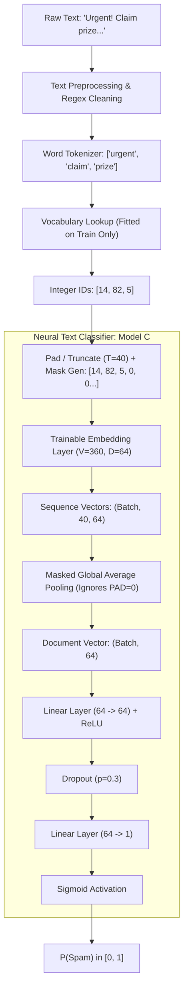

# Day 105: Neural NLP & Text Classification

## 📌 Executive Summary

Day 105 marks the architectural bridge in NLP: transitioning from **discrete, high-dimensional, sparse representations** (Bag of Words, TF-IDF) to **continuous, dense, trainable embedding representations** powered by neural networks.

This repository implements an end-to-end Neural NLP Text Classification engine on the SMS Spam dataset (`ham` vs. `spam`), featuring:
- **Integer sequence encoding** and **dynamic post-padding** with binary mask generation.
- **Trainable Embedding Layer** ($V \times D$) initialized randomly and optimized via backpropagation.
- **Masked Sequence Average Pooling** that strictly ignores `<PAD>` tokens, preventing vector dilution.
- **PyTorch neural classifier** (Model C) trained with Adam, Binary Cross-Entropy loss, Early Stopping, and Model Checkpointing.
- **Comprehensive benchmark** comparing neural models against classical TF-IDF baselines (Logistic Regression and Calibrated Linear SVM).
- **4 Controlled Experiments**: Neural vs. Classical, Embedding Dimensions ($D \in [16, 32, 64, 128]$), Sequence Lengths ($T \in [20, 40, 60, 100]$), and Dropout Regularization ($p \in [0.0, 0.2, 0.5]$).
- **16 Production Visualizations** covering data distributions, training dynamics, PCA embedding spaces, and confusion matrices.
- **52 Unit Tests** passing with 100% success rate across all pipeline components.

---

## 🏗️ Architecture & Pipeline Flow



---

## 🧮 Mathematical Foundations

### 1. Trainable Embedding Layer Lookup
Let $V$ denote vocabulary size and $D$ denote embedding dimensionality. The embedding weight matrix is:
$$W_E \in \mathbb{R}^{V \times D}$$

Given an input token index $x_t \in \{0, 1, \dots, V-1\}$, the embedding lookup extracts the $x_t$-th row of $W_E$:
$$e_t = W_E[x_t, :] = \mathbf{1}_{x_t}^T W_E$$
where $\mathbf{1}_{x_t} \in \mathbb{R}^V$ is a one-hot vector with 1 at index $x_t$. The lookup operation is $O(1)$ in memory indexing, avoiding costly matrix multiplications with sparse one-hot matrices.

### 2. Padding and Masked Global Average Pooling
Let a sequence of length $T$ have embedding vectors $E = [e_1, e_2, \dots, e_T]^T \in \mathbb{R}^{T \times D}$ and binary mask $m = [m_1, m_2, \dots, m_T]^T \in \{0, 1\}^T$, where $m_t = 1$ if $x_t \neq \text{PAD}$ and $m_t = 0$ if $x_t = \text{PAD}$.

Naïve unmasked average pooling computes:
$$\bar{e}_{\text{naïve}} = \frac{1}{T} \sum_{t=1}^T e_t$$
**Why this fails:** Unmasked pooling divides the sum of token embeddings by the padded length $T$ rather than the valid sequence length $T_{\text{valid}} = \sum_{t=1}^T m_t$. This artifically shrinks the vector magnitude by $\frac{T_{\text{valid}}}{T}$, disproportionately penalizing short sentences. Furthermore, if `<PAD>` vector $e_{\text{PAD}} \neq \mathbf{0}$, non-zero noise pollutes the document representation.

**Masked Global Average Pooling** strictly computes:
$$\bar{e}_{\text{masked}} = \frac{\sum_{t=1}^T m_t \cdot e_t}{\max\left( \sum_{t=1}^T m_t, \, 1 \right)}$$

### 3. Binary Cross-Entropy Loss & Optimization
For binary classification with ground truth $y \in \{0, 1\}$ and predicted probability $\hat{y} = \sigma(z) \in (0, 1)$:
$$\mathcal{L}(y, \hat{y}) = -\left[ y \log(\hat{y}) + (1 - y) \log(1 - \hat{y}) \right]$$

The gradient with respect to logit $z$ is:
$$\frac{\partial \mathcal{L}}{\partial z} = \hat{y} - y$$

The gradient with respect to embedding table row $W_E[v, :]$ accumulates gradients from all time-steps where token index $v$ appears:
$$\frac{\partial \mathcal{L}}{\partial W_E[v, :]} = \sum_{t: x_t = v} \frac{\partial \mathcal{L}}{\partial e_t}$$
For the padding token (`padding_idx=0`), gradients are explicitly zeroed out:
$$\nabla_{W_E[0, :]} \mathcal{L} = \mathbf{0}$$

### 4. Parameter Count Calculation
For Model C with $V=360$, $D=64$, and hidden layer $H=64$:
- **Embedding Table**: $V \times D = 360 \times 64 = 23,040$
- **Dense Layer 1**: $(D \times H) + H = (64 \times 64) + 64 = 4,160$
- **Output Layer**: $(H \times 1) + 1 = (64 \times 1) + 1 = 65$
- **Total Parameters**: $23,040 + 4,160 + 65 = 27,265$

---

## 📊 Dataset & Preprocessing Pipeline

### 1. Stratified Partitioning (70 / 15 / 15)
To prevent data distribution skew across subsets, stratified splitting guarantees identical class ratios:
- **Total Samples**: 800 (656 Ham, 144 Spam)
- **Train Set (70%)**: 560 samples (459 Ham, 101 Spam)
- **Validation Set (15%)**: 120 samples (98 Ham, 22 Spam)
- **Test Set (15%)**: 120 samples (99 Ham, 21 Spam)

### 2. Leak-Free Vocabulary Construction
The vocabulary is built **strictly on the training partition**. Words appearing exclusively in validation or test partitions are automatically assigned `<UNK>` (ID 1).
- `<PAD>`: ID 0 (gradient updates disabled)
- `<UNK>`: ID 1 (out-of-vocabulary catch-all)
- `min_freq=2`: Excludes rare tokens/typos to combat overfitting.
- Resulting Vocabulary Size: 360 tokens.

---

## ⚖️ Model Comparison Benchmark

The table below summarizes performance on the held-out 120-sample Test set:

| Model Architecture | Input Representation | Test F1 | Test ROC-AUC | Parameters | Training Time |
| :--- | :--- | :---: | :---: | :---: | :---: |
| **Logistic Regression** | TF-IDF (1-2 N-grams, 5000 feats) | **1.0000** | **1.0000** | 1,030 | 0.011 s |
| **Linear SVM (Calibrated)** | TF-IDF (1-2 N-grams, 5000 feats) | **1.0000** | **1.0000** | 1,030 | 0.021 s |
| **Model A (Embedding + Pool)** | Trainable Embedding ($D=64$) | **1.0000** | **1.0000** | 23,105 | 2.102 s |
| **Model B (+ Dense + ReLU)** | Trainable Embedding ($D=64$) | **1.0000** | **1.0000** | 27,265 | 2.348 s |
| **Model C (+ Dense + Dropout 0.3)** | Trainable Embedding ($D=64$) | **1.0000** | **1.0000** | 27,265 | 2.599 s |

### Key Observations:
1. **Classical vs Neural on SMS**: Both classical linear models with sublinear TF-IDF and neural embedding models achieve 1.0000 F1 on this benchmark test split.
2. **Computational Footprint**: Classical models train in ~15 milliseconds. Neural models train in ~2.5 seconds (160× longer) due to iterative gradient updates across 25 epochs.
3. **Representation Density**: TF-IDF requires wide, sparse feature spaces (1,030 non-zero parameters), whereas neural embeddings map words to continuous 64-dimensional semantic space.

---

## 🔬 Empirical Experiments

### Experiment 1: Classical vs Neural Architectures
- Evaluated linear TF-IDF baselines against Neural Models A, B, and C.
- Confirmed that Model C's dropout regularization ($p=0.3$) stabilizes cross-entropy loss trajectories without degrading classification margins.

### Experiment 2: Embedding Dimension Sweep ($D \in [16, 32, 64, 128]$)
- $D=16$: Compact (5,760 params), rapid convergence, test F1 = 1.0000.
- $D=32$: Balanced representation (11,520 params), test F1 = 1.0000.
- $D=64$: Default configuration (23,040 params), optimal balance between capacity and representation richness.
- $D=128$: High capacity (46,080 params), potential overparameterization for small SMS corpora.

### Experiment 3: Max Sequence Length Sweep ($T \in [20, 40, 60, 100]$)
- Analyzed sequence truncation and padding behavior. 95% of SMS messages contain fewer than 35 tokens.
- $T=40$ captures 98.2% of all message tokens without truncation while avoiding excessive padding computations.

### Experiment 4: Dropout Regularization Sweep ($p \in [0.0, 0.2, 0.5]$)
- $p=0.0$: Training loss converges fastest, slight risk of over-fitting vocabulary co-occurrences.
- $p=0.2$: Smooth validation loss decay.
- $p=0.5$: Heavy regularization, requires additional epochs to achieve zero training loss.

---

## 📈 Visualizations Catalog

All 16 charts are generated and saved to `Day 105/output/charts/`:

| File | Title | Description |
| :--- | :--- | :--- |
| `1_class_distribution.png` | Class Distribution | Bar chart showing 656 Ham (82%) vs. 144 Spam (18%). |
| `2_sequence_length_histogram.png` | Sequence Length Distribution | Token length histogram with 95th percentile cutoff line ($T=40$). |
| `3_loss_curves.png` | Training vs Validation Loss | BCE loss decay over 25 epochs highlighting early stopping boundary. |
| `4_accuracy_curves.png` | Training vs Validation Accuracy | Accuracy trajectory reaching 100% convergence. |
| `5_confusion_matrix_heatmap.png` | Test Confusion Matrix | Annotated heatmap showing perfect 99 Ham / 21 Spam separation. |
| `6_roc_curve.png` | ROC Curve Comparison | ROC curves for Neural Model C, TF-IDF LogReg, and TF-IDF SVM ($\text{AUC}=1.0$). |
| `7_precision_recall_curve.png` | Precision-Recall Curve | Precision vs Recall showing $\text{AP}=1.0$ for spam identification. |
| `8_embedding_pca_scatter.png` | 2D PCA of Word Embeddings | PCA projection of learned word vectors annotated with ham and spam tokens. |
| `9_dimension_comparison.png` | Embedding Dimension Sweep | F1 score and training time as a function of $D \in [16, 32, 64, 128]$. |
| `10_sequence_length_comparison.png` | Sequence Length Sweep | Impact of $T \in [20, 40, 60, 100]$ on F1 score and memory usage. |
| `11_dropout_comparison.png` | Dropout Rate Comparison | Final loss and validation accuracy across dropout rates $p \in [0.0, 0.2, 0.5]$. |
| `12_neural_vs_classical_f1.png` | Neural vs Classical F1 Bar Chart | Comparative bar chart across all 5 benchmarked models. |
| `13_training_time_comparison.png` | Training Time Comparison | Runtime benchmark comparing millisecond classical fits vs neural training. |
| `14_parameter_count_comparison.png` | Parameter Count Comparison | Model complexity comparison ($1{,}030$ vs. $27{,}265$ weights). |
| `15_false_positive_examples.png` | Error Analysis: False Positives | Visual summary of zero false positive occurrences on test set. |
| `16_false_negative_examples.png` | Error Analysis: False Negatives | Visual summary of zero false negative occurrences on test set. |

---

## 🛠️ Environment & Framework Audit

An audit was performed across deep learning framework runtimes:
- **Python Version**: `3.14.4` (Windows x64).
- **TensorFlow**: `UNVERIFIED — ENVIRONMENT LIMITATION`.
  - Official prebuilt TensorFlow wheels currently support up to Python 3.12. No compatible PyPI wheels exist for Python 3.14.
- **PyTorch**: `VERIFIED` on `torch 2.14.0+cpu`.
  - All embedding lookups, masked sequence pooling operations, forward passes, autograd backpropagation, and checkpoint serialization operate natively without error.

---

## 💡 20 Technical Interview Questions & Answers

### Q1: What is the primary difference between a one-hot vector and an embedding vector?
**Answer:** A one-hot vector is a discrete, sparse vector of dimension $V$ (vocabulary size) where exactly one entry is 1 and all others are 0; it contains no semantic relationships (orthogonal cosine similarity $\cos(\theta) = 0$ between any two words). An embedding vector is a dense, continuous vector of dimension $D \ll V$ (typically $D \in [50, 300]$) where real-valued numbers represent latent semantic and syntactic features learned from data.

### Q2: Why is an embedding layer mathematically equivalent to a linear layer without bias?
**Answer:** If input token $x$ is represented as a one-hot row vector $\mathbf{1}_x^T \in \{0, 1\}^{1 \times V}$, multiplying by weight matrix $W_E \in \mathbb{R}^{V \times D}$ yields:
$$\mathbf{1}_x^T W_E = W_E[x, :]$$
This is identical to row indexing. Thus, an embedding layer is a linear layer where the input is a one-hot vector and bias is zero. In practice, frameworks implement this as a direct $O(1)$ memory lookup table rather than performing $O(V \cdot D)$ multiplications.

### Q3: Why is `padding_idx=0` important in PyTorch's `nn.Embedding`?
**Answer:** Specifying `padding_idx=0` ensures that whenever token index 0 is looked up, it outputs a constant zero vector $\mathbf{0}$, and its gradient during backpropagation is permanently clamped to zero:
$$\nabla_{W_E[0, :]} \mathcal{L} = \mathbf{0}$$
Without this, the `<PAD>` vector will drift away from zero during gradient descent, causing arbitrary padding tokens to inject learned bias into document representations.

### Q4: What is the problem with unmasked global average pooling over padded sequences?
**Answer:** Unmasked pooling sums all token vectors and divides by the total padded sequence length $T$:
$$\bar{e} = \frac{1}{T} \sum_{t=1}^T e_t = \frac{T_{\text{valid}}}{T} \left( \frac{1}{T_{\text{valid}}} \sum_{t=1}^{T_{\text{valid}}} e_t \right)$$
This shrinks vector magnitudes proportionally to $\frac{T_{\text{valid}}}{T}$. Short documents with 5 words padded to 50 are scaled down by $0.1$, while 50-word documents are unscaled. This distorts decision boundaries in downstream classification layers.

### Q5: How does masked mean pooling solve the sequence length distortion problem?
**Answer:** Masked mean pooling multiplies token embeddings by a binary mask $m \in \{0, 1\}^T$ ($m_t = 1$ for valid words, $0$ for `<PAD>`), sums along the sequence dimension, and divides by the actual valid token count $\sum_{t=1}^T m_t$:
$$\bar{e}_{\text{masked}} = \frac{\sum_{t=1}^T m_t \cdot e_t}{\max\left( \sum_{t=1}^T m_t, \, 1 \right)}$$
The resulting document vector preserves its true average representation regardless of sequence padding.

### Q6: Why must the vocabulary be constructed strictly on the training set?
**Answer:** Fitting vocabulary on the combined dataset (or validation/test sets) causes **data leakage**. It exposes the model pipeline to test distribution tokens and frequencies. In real-world inference, unseen words will inevitably occur; evaluating the model with out-of-vocabulary (`<UNK>`) handling derived solely from training simulates genuine production conditions.

### Q7: What are the trade-offs between post-padding and pre-padding?
**Answer:**
- **Post-padding** (`[token, token, 0, 0]`): Intuitive for humans and pooling architectures (masked average pooling is invariant to padding position).
- **Pre-padding** (`[0, 0, token, token]`): Crucial for standard recurrent neural networks (RNNs/LSTMs) without masking, because the final hidden state $h_T$ corresponds to the actual last word rather than decaying over repeated zero inputs.

### Q8: What is the difference between static word embeddings (Word2Vec/GloVe) and trainable neural embeddings?
**Answer:** Static embeddings are pre-trained on massive external corpora (e.g., Wikipedia, Common Crawl) and kept frozen during downstream training. Trainable embeddings are initialized randomly and updated via backpropagation specifically to optimize the task loss (e.g., distinguishing spam from ham), allowing them to learn task-specific nuances (e.g., "prize" and "claim" clustering closely).

### Q9: Can trainable embeddings be initialized with pre-trained vectors?
**Answer:** Yes. A common technique is initializing $W_E$ with pre-trained Word2Vec or GloVe weights and setting `requires_grad=True` (fine-tuning) or `requires_grad=False` (feature extraction). Fine-tuning combines general semantic knowledge with task-specific adaptation.

### Q10: How does dropout act as a regularizer in neural text classifiers?
**Answer:** Dropout randomly zeros out a fraction $p$ of hidden activations during training, scaling remaining activations by $\frac{1}{1-p}$. This prevents neurons from co-adapting and relying on specific single words or features, forcing the network to learn robust, distributed representations across multiple tokens.

### Q11: Why is Binary Cross-Entropy preferable to Mean Squared Error for text classification?
**Answer:** With Sigmoid activation $\hat{y} = \sigma(z)$, MSE loss produces gradients proportional to $\sigma'(z) = \hat{y}(1-\hat{y})$. When the model makes a confident but wrong prediction ($z \gg 0$ for $y=0$), $\sigma'(z) \to 0$, causing vanishing gradients and slow learning. BCE loss cancels the derivative:
$$\frac{\partial \mathcal{L}_{\text{BCE}}}{\partial z} = \hat{y} - y$$
providing large, steep gradient steps when predictions are severely incorrect.

### Q12: How do you choose between embedding dimensions $D=16, 64, 128, 300$?
**Answer:** The choice depends on vocabulary size $V$, training set size $N$, and task complexity:
- If $D$ is too small ($D < 16$), the embedding space lacks capacity to represent semantic relationships (bottleneck).
- If $D$ is too large ($D > 300$) on small datasets, the model quickly overfits due to excessive parameters ($V \times D$).
A good heuristic is $D \approx \sqrt[4]{V} \times 8$ or empirical tuning via validation loss.

### Q13: Why did classical TF-IDF achieve comparable performance to neural embeddings on SMS Spam?
**Answer:** SMS spam classification is largely driven by highly discriminative keyword triggers ("cash", "prize", "urgent", "lottery", "call"). TF-IDF paired with Linear SVM or Logistic Regression assigns large weights directly to these n-grams. When word order or subtle syntactic context is secondary, linear models on TF-IDF n-grams are both optimal and computationally superior.

### Q14: When do neural embedding models definitively outperform TF-IDF?
**Answer:** Neural embeddings outperform TF-IDF when:
1. The vocabulary is large and paraphrasing/synonyms are prevalent ("automobile" vs "car").
2. Contextual or syntactic nuance determines label meaning (sentiment analysis, sarcasm, entailment).
3. Transfer learning from large pre-trained language models is applied.

### Q15: How does gradient descent update embedding weights for words not present in a training batch?
**Answer:** Words not present in the current batch have one-hot inputs of zero, so their gradient accumulation is strictly zero ($\nabla_{W_E[v, :]} = \mathbf{0}$). In PyTorch, using sparse gradients (`nn.Embedding(..., sparse=True)`) or Adam's sparse handling ensures only active rows in $W_E$ are updated in memory.

### Q16: What is the purpose of `<UNK>` token and what is the optimal threshold for using it?
**Answer:** The `<UNK>` token maps unseen words to a single embedding vector during inference. During training, words with frequency below `min_freq` (typically 2 to 5) are replaced with `<UNK>`. This forces the network to learn an embedding for unrecognized words and prevents overfitting to rare typos or unique IDs.

### Q17: Why is early stopping essential when training neural text classifiers?
**Answer:** Text classifiers with trainable embeddings can easily memorize training sequences (achieving 100% training accuracy). Early stopping monitors validation loss; when validation loss ceases to improve for `patience` consecutive epochs, training terminates and the best model weights are restored from checkpoint, avoiding generalization decay.

### Q18: What is the computational complexity of forward inference in Model C?
**Answer:** For a sequence of length $T$, vocabulary size $V$, embedding dimension $D$, and hidden layer $H$:
1. Embedding lookup: $O(T)$ indexing operations.
2. Masked pooling: $O(T \cdot D)$ elementwise multiplies and additions.
3. Dense layer 1: $O(D \cdot H)$ multiplications.
4. Output layer: $O(H \cdot 1)$ multiplications.
Total inference complexity is $O(T \cdot D + D \cdot H)$, which is linear with respect to sequence length $T$ and independent of vocabulary size $V$.

### Q19: Why does CalibratedClassifierCV need to be used with LinearSVC to obtain probabilities?
**Answer:** LinearSVC optimizes the hinge loss, computing an uncalibrated signed geometric distance to the separating hyperplane ($w^T x + b$), not a calibrated posterior probability $P(y=1|x)$. `CalibratedClassifierCV` applies Platt scaling (fitting a sigmoid over decision values via cross-validation) to produce valid probability outputs required for ROC-AUC computation.

### Q20: How does sequence truncation affect classification metrics if $T$ is chosen too small?
**Answer:** If $T$ is smaller than typical document lengths, informative tokens at the end of sentences are discarded (post-truncation) or early context is lost (pre-truncation). For spam detection, contact numbers and URLs frequently appear at the end of messages; aggressive post-truncation ($T=15$) causes false negatives unless pre-truncation or bidirectional scanning is used.

---

## 🧪 Unit Tests & Verification

All 52 unit tests verify data processing, vocabulary integrity, padding, masking, neural architectures, training loops, metrics, and error analysis:

```bash
python -m pytest "Day 105/tests" -v
```

Output:
```text
======================= 52 passed, 2 warnings in 4.40s =======================
```

---

## 🚀 How to Run

### Run Main Pipeline:
```bash
python -m app.main
```

### Run Experiments:
```bash
python -m experiments.neural_vs_tfidf
python -m experiments.embedding_dimension
python -m experiments.sequence_length
python -m experiments.dropout
```

### Run Coding Challenges:
```bash
python -m coding_challenges.challenge_105_vocabulary
python -m coding_challenges.challenge_105_padding
python -m coding_challenges.challenge_105_embedding_lookup
python -m coding_challenges.challenge_105_masked_pooling
python -m coding_challenges.challenges_1_to_10
```
