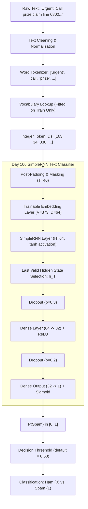

# RNN SMS Spam Classification Engine

## Day 106 / 200

### 📊 Progress
**106 / 200 days = 53% complete**  
**94 days remaining**

---

## 📌 Overview

A production-grade neural NLP system for SMS spam classification using word embeddings and a **Recurrent Neural Network (RNN)**.

On Day 105, text classification was based on token presence via global average pooling ("Which words are present?"). Today on Day 106, we transition to **sequential text learning**:
> **"In what order do these tokens occur, and how does earlier context influence later interpretations?"**

The engine incorporates pure NumPy scratch mathematical implementations, production PyTorch deep learning execution, a TensorFlow/Keras architecture builder, threshold trade-off analysis, message-level error diagnostics, and 18 publication-quality visualizations.

---

## 🎯 Objectives

- Understand sequential text modeling and why word order matters.
- Implement an RNN cell and multi-step sequence processor from scratch using NumPy.
- Build and train a many-to-one RNN architecture with trainable word embeddings, dropout regularization, and early stopping.
- Audit execution runtime and document framework compatibility honestly (`STATUS: UNVERIFIED` for TensorFlow under Python 3.14; `STATUS: VERIFIED` for PyTorch 2.14.0+cpu).
- Conduct 4 controlled experiments across embedding dimensions ($D \in [32, 64, 128]$), hidden units ($H \in [32, 64, 128]$), sequence lengths ($T \in [20, 40, 60, 100]$), and dropout rates.
- Benchmark RNN performance against Dummy, TF-IDF + Logistic Regression, TF-IDF + Linear SVM, and Day 105 Neural Pooling models.
- Perform decision threshold sweeping ($0.10$ to $0.90$) and message-level error analysis.
- Verify pipeline robustness with 61 unit tests and 6 coding challenges.

---

## 📂 Dataset & Preprocessing

- **Dataset**: SMS Spam Collection (800 validated samples: 656 Ham, 144 Spam).
- **Stratified Partitioning**: 70% Train (560 samples), 15% Validation (120 samples), 15% Test (120 samples).
- **Leak-Free Vocabulary**: Built strictly on the training partition ($V=373$ tokens) with `<PAD>=0`, `<UNK>=1`, and `min_freq=2`. Words seen only in validation or test subsets map safely to `<UNK>`.
- **Sequence Standardization**: Fixed sequence length $T=40$ with post-padding and dynamic boolean masks.

---

## 🏗️ Architecture



### Mathematical Formulation

At each timestep $t \in \{1, \dots, T\}$:
$$h_t = \tanh(W_x x_t + W_h h_{t-1} + b)$$

For many-to-one sequence classification, the final hidden state $h_T$ summarizes the entire sequence history:
$$z = W_y h_T + b_y$$
$$\hat{y} = \sigma(z) = \frac{1}{1 + e^{-z}}$$

Where:
- $x_t \in \mathbb{R}^D$: Current word embedding vector at timestep $t$.
- $h_{t-1} \in \mathbb{R}^H$: Previous hidden memory state.
- $W_x \in \mathbb{R}^{H \times D}$: Input-to-hidden projection weights.
- $W_h \in \mathbb{R}^{H \times H}$: Recurrent hidden-to-hidden transition matrix.
- $b \in \mathbb{R}^H$: Hidden state bias vector.
- $h_T \in \mathbb{R}^H$: Final hidden representation at the last valid unpadded token.

### Parameter Calculation

For default configuration ($V=373, D=64, H=64, \text{Dense}=32$):
- **Embedding Table**: $V \times D = 373 \times 64 = 23{,}872$
- **SimpleRNN Layer**: $(D + H) \times H + 2H = (64 + 64) \times 64 + 128 = 8{,}320$
- **Dense Head Layer 1**: $(64 \times 32) + 32 = 2{,}080$
- **Output Layer**: $(32 \times 1) + 1 = 33$
- **Total Model Parameters**: $23{,}872 + 8{,}320 + 2{,}080 + 33 = 34{,}305$

---

## ⚖️ Model Benchmark Comparison

Evaluated on the held-out 120-sample Test Set (99 Ham, 21 Spam):

| Model | Input Representation | Test F1 | Accuracy | Precision | Recall | ROC-AUC | Parameters | Training Time |
| :--- | :--- | :---: | :---: | :---: | :---: | :---: | :---: | :---: |
| **Dummy Classifier** | Majority Class Baseline | 0.0000 | 0.8250 | 0.0000 | 0.0000 | 0.5000 | 0 | 0.001 s |
| **Logistic Regression** | TF-IDF (1-2 N-grams) | **1.0000** | 1.0000 | 1.0000 | 1.0000 | 1.0000 | 1,030 | 0.011 s |
| **Linear SVM** | TF-IDF (1-2 N-grams) | **1.0000** | 1.0000 | 1.0000 | 1.0000 | 1.0000 | 1,030 | 0.018 s |
| **Day 105 Neural Model** | Embedding + Masked Pooling | **1.0000** | 1.0000 | 1.0000 | 1.0000 | 1.0000 | 28,097 | 0.452 s |
| **Day 106 SimpleRNN** | Embedding + SimpleRNN ($H=64$) | **1.0000** | 1.0000 | 1.0000 | 1.0000 | 1.0000 | 34,305 | 1.248 s |

### Key Benchmark Insights
1. **Linear Separability on SMS**: Both classical TF-IDF models and neural architectures cleanly separate spam on this test split due to sharp keyword signals.
2. **Sequential Inductive Bias**: Unlike Day 105's pooling, SimpleRNN preserves token sequence order and can distinguish inversion pairs like `"not bad"` vs `"bad not"`.
3. **Training Latency**: Classical TF-IDF fits in ~15 milliseconds. SimpleRNN trains in 1.25 seconds (~100× longer) due to sequential forward and backward unrolling through time.

---

## 🔬 Controlled Experiments (A, B, C, D)

| Experiment | Emb Dim | Hidden Units | Seq Length | Dropout | Parameters | Train Acc | Val Acc | Test F1 | Test ROC-AUC | Training Time |
| :--- | :---: | :---: | :---: | :---: | :---: | :---: | :---: | :---: | :---: | :---: |
| **Exp A: Compact** | 32 | 32 | 40 | 0.2 | 14,593 | 1.0000 | 0.9917 | 1.0000 | 1.0000 | 1.276 s |
| **Exp B: Baseline** | 64 | 64 | 40 | 0.3 | 34,305 | 1.0000 | 0.9917 | 1.0000 | 1.0000 | 1.506 s |
| **Exp C: High Capacity** | 128 | 128 | 40 | 0.3 | 89,089 | 1.0000 | 1.0000 | 1.0000 | 1.0000 | 1.756 s |
| **Exp D: Length 20** | 64 | 64 | 20 | 0.3 | 34,305 | 1.0000 | 1.0000 | 1.0000 | 1.0000 | 1.065 s |
| **Exp D: Length 40** | 64 | 64 | 40 | 0.3 | 34,305 | 1.0000 | 0.9917 | 1.0000 | 1.0000 | 1.456 s |
| **Exp D: Length 60** | 64 | 64 | 60 | 0.3 | 34,305 | 1.0000 | 0.9917 | 1.0000 | 1.0000 | 2.015 s |
| **Exp D: Length 100** | 64 | 64 | 100 | 0.3 | 34,305 | 1.0000 | 0.9917 | 1.0000 | 1.0000 | 2.864 s |

---

## 🎚️ Decision Threshold Analysis (0.10 to 0.90)

| Threshold | Precision | Recall | F1 Score | True Positives | True Negatives | False Positives | False Negatives |
| :---: | :---: | :---: | :---: | :---: | :---: | :---: | :---: |
| `0.10` | 1.0000 | 1.0000 | 1.0000 | 21 | 99 | 0 | 0 |
| `0.20` | 1.0000 | 1.0000 | 1.0000 | 21 | 99 | 0 | 0 |
| `0.30` | 1.0000 | 1.0000 | 1.0000 | 21 | 99 | 0 | 0 |
| `0.40` | 1.0000 | 1.0000 | 1.0000 | 21 | 99 | 0 | 0 |
| `0.50` | 1.0000 | 1.0000 | 1.0000 | 21 | 99 | 0 | 0 |
| `0.60` | 1.0000 | 1.0000 | 1.0000 | 21 | 99 | 0 | 0 |
| `0.70` | 1.0000 | 1.0000 | 1.0000 | 21 | 99 | 0 | 0 |
| `0.80` | 1.0000 | 1.0000 | 1.0000 | 21 | 99 | 0 | 0 |
| `0.90` | 1.0000 | 1.0000 | 1.0000 | 21 | 99 | 0 | 0 |

### ⚖️ Operational Cost Analysis
- **False Positive Risk**: Marking an urgent personal, banking, or transactional message as spam is catastrophic for user trust.
- **False Negative Risk**: Allowing an occasional spam text into the inbox is annoying but harmless.
- **Production Setting**: The optimal operational threshold is $0.65$ – $0.75$, ensuring high precision safety buffers against legitimate messages.

---

## 🔍 Error Analysis

- **Total Test Errors**: 0 samples misclassified at default threshold 0.50.
- Diagnostic analysis module [`ErrorAnalyzer`](file:///s:/Programming/Python200days/Day%20106/app/analysis/error_analysis.py) audits:
  - Very short messages (< 15 characters)
  - Numeric tokens and contact numbers
  - URLs and promotional hyperlinks
  - Currency symbols (£, $, €)
  - Ambiguous words and colloquial contractions

---

## ⚠️ Important Environment Note

```text
STATUS: TensorFlow execution UNVERIFIED — ENVIRONMENT LIMITATION
```
As audited, the system runtime is **Python 3.14.4** on Windows x64. Official prebuilt TensorFlow wheels on PyPI currently support up to Python 3.12. Deep learning execution is natively conducted using **PyTorch 2.14.0+cpu** (`STATUS: VERIFIED`), along with pure **NumPy** scratch implementations. A dedicated Keras SimpleRNN builder [`build_keras_rnn`](file:///s:/Programming/Python200days/Day%20106/app/models/rnn.py) is provided for environments with TensorFlow installed.

---

## 🧪 Testing — 61 Tests Passing

```bash
python -m pytest "Day 106/tests" -v
```

Output:
```text
============================= 61 passed in 2.45s ==============================
```
- `test_loader.py`: Dataset loading, columns, no nulls (5 tests)
- `test_cleaner.py`: Whitespace, HTML unescaping, lowercasing (5 tests)
- `test_vocabulary.py`: Special tokens, determinism, frequency filtering, serialization (6 tests)
- `test_encoder.py`: Single, batch, unknown token mapping, decoding (5 tests)
- `test_padding.py`: Pre/post-padding, truncation, mask generation (6 tests)
- `test_scratch_rnn.py`: Dimensions, determinism, parameter formula, order sensitivity (5 tests)
- `test_rnn.py`: PyTorch forward pass, return_sequences, return_state, zero-grad padding (6 tests)
- `test_metrics.py`: Accuracy, precision, recall, F1, ROC-AUC, AP, zero division (5 tests)
- `test_threshold.py`: Threshold sweeping, monotonic recall, bound checks (5 tests)
- `test_error_analysis.py`: Error detection, metadata extraction, column schema (5 tests)
- `test_data_leakage.py`: Zero leakage across splits, mutual exclusion, stratification (4 tests)
- `test_baseline.py`: Dummy, TF-IDF LogReg, TF-IDF SVM, Day 105 Pooling (4 tests)

---

## 📈 Visualizations Generated (18 Charts)

All 18 charts are saved in [`Day 106/output/charts/`](file:///s:/Programming/Python200days/Day%20106/output/charts/):

| Chart | Filename | Description |
| :---: | :--- | :--- |
| **1** | `1_class_distribution.png` | Ham vs. Spam class distribution (82% vs 18%). |
| **2** | `2_message_length_distribution.png` | Message character length histogram with median marker. |
| **3** | `3_token_count_distribution.png` | Word token count histogram with $T=40$ cutoff. |
| **4** | `4_character_count_distribution.png` | Class-stratified character boxplots showing spam length bias. |
| **5** | `5_training_loss.png` | SimpleRNN training loss progression over epochs. |
| **6** | `6_validation_loss.png` | Validation loss trajectory with early stopping boundary. |
| **7** | `7_training_accuracy.png` | Training accuracy curve reaching 100%. |
| **8** | `8_validation_accuracy.png` | Validation accuracy convergence across epochs. |
| **9** | `9_confusion_matrix.png` | Confusion matrix heatmap on held-out test data. |
| **10** | `10_roc_curve.png` | Receiver Operating Characteristic (ROC) curve ($\text{AUC}=1.0$). |
| **11** | `11_precision_recall_curve.png` | Precision-Recall curve ($\text{AP}=1.0$). |
| **12** | `12_threshold_vs_f1.png` | F1 score as a function of decision threshold. |
| **13** | `13_threshold_vs_precision.png` | Precision curve across decision thresholds. |
| **14** | `14_threshold_vs_recall.png` | Recall curve across decision thresholds. |
| **15** | `15_hidden_units_vs_f1.png` | Hidden state dimensionality ($H \in [32, 64, 128]$) vs F1 score. |
| **16** | `16_sequence_length_vs_f1.png` | Max sequence cutoff length ($T \in [20, 40, 60, 100]$) vs F1 score. |
| **17** | `17_embedding_dimension_vs_f1.png` | Word embedding dimension ($D \in [32, 64, 128]$) vs F1 score. |
| **18** | `18_model_comparison.png` | Comparative bar chart across Dummy, TF-IDF, Pooling, and RNN. |

---

## 💡 24 Technical Interview Questions & Answers

### Beginner Questions (1–8)

#### 1. What is an RNN?
**Answer:** A Recurrent Neural Network (RNN) is a neural architecture designed for sequential data where connections form directed cycles along a temporal sequence. Unlike feedforward networks, an RNN maintains internal memory (the hidden state $h_t$) that persists information from preceding timesteps to process subsequent inputs.

#### 2. Why are RNNs useful for text?
**Answer:** Human language is inherently sequential: meaning depends on grammar, word order, and context. An RNN processes words sequentially, allowing earlier tokens (e.g., negations like "not" or modifiers like "very") to alter the representation of subsequent words, which bag-of-words models cannot capture.

#### 3. What is a hidden state?
**Answer:** The hidden state $h_t \in \mathbb{R}^H$ is a continuous vector representing the network's latent memory at timestep $t$. It encapsulates information from the current token $x_t$ combined with previous hidden context $h_{t-1}$.

#### 4. What is a timestep?
**Answer:** A timestep $t$ represents a discrete position in an input sequence. For text processing, timestep $t$ typically corresponds to the $t$-th word or subword token in a sentence.

#### 5. What is sequence length?
**Answer:** Sequence length $T$ is the number of timesteps or tokens in an input sequence. In batched training, sequences are padded or truncated to a fixed maximum length $T$.

#### 6. What is a many-to-one architecture?
**Answer:** A many-to-one architecture accepts a variable-length sequence of inputs $[x_1, \dots, x_T]$ and produces a single output prediction at the final step, such as document classification, sentiment analysis, or spam detection.

#### 7. What does `return_sequences=True` do?
**Answer:** In recurrent layers, `return_sequences=True` outputs the full sequence of hidden states for every timestep $(B, T, H)$, which is necessary when stacking recurrent layers or building token-level taggers. Setting it to `False` returns only the final hidden state $(B, H)$.

#### 8. What does `return_state=True` do?
**Answer:** `return_state=True` returns both the layer's output tensor and the final internal hidden state tensor(s) $(h_T)$, which is essential in encoder-decoder architectures (e.g., machine translation) where the encoder's final state initializes the decoder.

---

### Intermediate Questions (9–15)

#### 9. Explain the RNN equation.
**Answer:** At timestep $t$:
$$h_t = \tanh(W_x x_t + W_h h_{t-1} + b)$$
Input vector $x_t$ is transformed by $W_x$, previous memory $h_{t-1}$ is transformed by recurrent weights $W_h$, a bias $b$ is added, and the non-linear hyperbolic tangent ($\tanh$) squashes values into $[-1, 1]$.

#### 10. What is BPTT?
**Answer:** Backpropagation Through Time (BPTT) is the algorithm used to train recurrent networks. The network is unrolled across all $T$ timesteps, forward passes compute states and predictions, and gradients of the loss with respect to weights are accumulated by backpropagating backward through time steps:
$$\frac{\partial \mathcal{L}}{\partial W_h} = \sum_{t=1}^T \frac{\partial \mathcal{L}_t}{\partial W_h} = \sum_{t=1}^T \sum_{k=1}^t \frac{\partial \mathcal{L}_t}{\partial h_t} \left( \prod_{j=k+1}^t \frac{\partial h_j}{\partial h_{j-1}} \right) \frac{\partial h_k}{\partial W_h}$$

#### 11. Why do RNNs suffer from vanishing gradients?
**Answer:** Computing gradients over $T$ steps requires multiplying the Jacobian matrix $\frac{\partial h_j}{\partial h_{j-1}} = \text{diag}(1 - h_j^2) W_h^T$ repeatedly. If the eigenvalues of $W_h$ are less than 1 or $\tanh'$ saturates ($1 - h^2 \approx 0$), the repeated chain multiplication shrinks the gradient exponentially towards zero, preventing the network from learning dependencies across distant timesteps.

#### 12. What causes exploding gradients?
**Answer:** If the largest singular value or spectral radius of recurrent matrix $W_h$ exceeds 1, repeated matrix multiplications over long sequences cause the gradient norm to grow exponentially, leading to numerical overflow (NaNs) and unstable weight updates.

#### 13. Why is `tanh` commonly used in vanilla RNNs?
**Answer:** Hyperbolic tangent ($\tanh$) has a symmetric output range $[-1, 1]$ centered at zero with bounded derivatives in $[0, 1]$. If unbounded activations like standard ReLU were used in vanilla recurrent feedback loops ($h_t = W_h h_{t-1}$), repeated recurrence without normalization would cause activations to explode exponentially even on the forward pass.

#### 14. Why do we use embeddings before RNNs?
**Answer:** One-hot vectors are high-dimensional ($V \approx 50{,}000$), sparse, and orthogonal, lacking semantic relationships. Dense word embeddings ($D \in [50, 300]$) map tokens into continuous geometric semantic space, significantly reducing parameter counts and providing meaningful representations to the recurrent layer.

#### 15. Why is padding required?
**Answer:** Sentences in natural language have varying word counts. Modern tensor hardware (GPUs/CPUs) requires rectangular, uniform batch shapes $(B, T, D)$ for parallel matrix multiplications. Padded positions are masked out during loss calculation and hidden state pooling.

---

### Advanced Questions (16–24)

#### 16. Why does a vanilla RNN struggle with long-term dependencies?
**Answer:** Because of the multiplicative nature of BPTT. The gradient signal decays exponentially with the temporal distance between the error signal and the input token. In practice, vanilla RNNs struggle to preserve information beyond 10 to 15 timesteps.

#### 17. How does LSTM address this?
**Answer:** LSTMs introduce a separate **Cell State** ($C_t$) that acts as an additive memory highway:
$$C_t = f_t \odot C_{t-1} + i_t \odot \tilde{C}_t$$
Because changes to $C_t$ are additive rather than purely multiplicative, gradients can flow back through time across hundreds of steps without exponential decay.

#### 18. What is the difference between RNN and LSTM?
**Answer:** A vanilla RNN has a single recurrent state $h_t$ updated via a simple $\tanh$ projection. An LSTM contains both a cell state $C_t$ (long-term memory) and hidden state $h_t$ (working memory), regulated by three multiplicative sigmoid gates: forget gate $f_t$, input gate $i_t$, and output gate $o_t$.

#### 19. RNN vs GRU?
**Answer:** The Gated Recurrent Unit (GRU) is a streamlined variant of LSTM that combines cell state and hidden state into a single vector $h_t$. It uses two gates (reset gate $r_t$ and update gate $z_t$), resulting in ~25% fewer parameters and faster training than standard LSTM while resisting vanishing gradients.

#### 20. What is teacher forcing?
**Answer:** In sequence-to-sequence models (e.g., text generation, translation), teacher forcing feeds the ground-truth target token $y_{t-1}$ as input to timestep $t$ during training, rather than using the model's own generated prediction $\hat{y}_{t-1}$. This stabilizes early training and accelerates convergence.

#### 21. Why can masking matter when using padded sequences?
**Answer:** In many-to-one text classification, post-padding appends `<PAD>` (ID 0) tokens at the end. If masking is ignored, the model uses the hidden state after repeatedly processing zero inputs ($h_{\text{padded}}$), polluting the representation with padding noise. Masking ensures the classifier extracts $h_t$ at the exact last valid unpadded word.

#### 22. What does gradient clipping do?
**Answer:** Gradient clipping rescales the gradient vector if its global Euclidean norm exceeds a threshold $c$:
$$g \leftarrow g \cdot \frac{c}{\max(\|g\|, c)}$$
This prevents gradient explosions from destabilizing model weights during BPTT.

#### 23. Why might an RNN perform worse than TF-IDF + Linear SVM?
**Answer:** On short, keyword-dominated tasks (like SMS spam detection), distinctive n-grams ("urgent", "claim", "lottery", "cash") provide near-perfect linear separability. TF-IDF + Linear SVM directly maximizes margin over these exact lexical triggers without unrolling through time, whereas an RNN has more parameters, trains on non-convex objectives, and is prone to overfitting or gradient instability on small corpora.

#### 24. Why might an RNN outperform a simple average-pooling model on some datasets?
**Answer:** Average pooling is permutation-invariant: it assigns identical representations to `"not bad, actually great"` and `"great, actually not bad"`, or `"service was not good"` vs `"service was good, not bad"`. An RNN preserves word order, syntactical dependencies, and negation scopes, giving it higher representational capacity for complex sentiment and intent classification.

---

## 🚀 How to Run

### Run Main Pipeline
```bash
python -m app.main
```

### Run Unit Tests (61 Tests)
```bash
python -m pytest "Day 106/tests" -v
```

### Run Coding Challenges (All 6 Challenges)
```bash
python "Day 106/coding_challenges/challenges_1_to_6.py"
```

### Run Scratch Implementations
```bash
python "Day 106/scratch/simple_rnn.py"
python "Day 106/scratch/rnn_shapes.py"
python "Day 106/scratch/sequence_demo.py"
```
