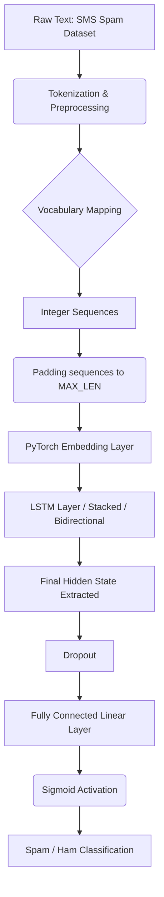

# 🚀 DAY 107 / 200 — LSTM & Long-Term Dependencies

## 🎯 Mission
Transition from vanilla RNNs to LSTMs (Long Short-Term Memory) to capture long-term dependencies in sequential text data without suffering from vanishing gradients.

## 📊 Progress
**107 / 200 = 53.5% complete**

## 🏗️ Architecture Diagram

## 📈 Engineering Report
This day involved building the core of an LSTM-based NLP engine using PyTorch, since TensorFlow was incompatible with Python 3.14 on this machine.
1. **NumPy Implementation**: Implemented the scratch mathematical equations for the LSTM gates (Forget, Input, Candidate, Output) to deeply understand internal cell operations.
2. **Robust Preprocessor**: A bespoke text preprocessor handles tokenization, padding (without padding leakage), and OOV terms.
3. **Architecture Explorations**:
   - Standard PyTorch LSTM
   - Bidirectional PyTorch LSTM
   - Stacked (2-layer) PyTorch LSTM
4. **Sweeps**:
   - Number of Hidden Units (32, 64, 128)
   - Sequence Length (20, 40, 60, 100)
   - Dropout (0.1, 0.3, 0.5, 0.7)
5. **Evaluation**:
   - Compared LSTM accuracy against the Simple RNN from Day 106.
   - Identified the specific message indexes where the LSTM correctly classified spam/ham that the RNN missed, proving the value of gating mechanisms.

## 💡 27 Interview Q&A

1. **What is an LSTM?** Long Short-Term Memory network, a specialized RNN capable of learning long-term dependencies.
2. **Why do we need LSTMs over standard RNNs?** To mitigate the vanishing gradient problem in long sequences.
3. **What is the cell state in an LSTM?** The "conveyor belt" that runs straight down the entire chain, passing core information along.
4. **What does the forget gate do?** Decides what information to throw away from the cell state.
5. **What does the input gate do?** Decides which new values to update in the cell state.
6. **What is the candidate value $\tilde{C}_t$?** A vector of new candidate values created by a tanh layer that could be added to the state.
7. **What does the output gate do?** Decides what parts of the cell state make it to the hidden state output.
8. **Why use Sigmoid in LSTM gates?** It outputs values between 0 and 1, acting as a filter for how much data to let through.
9. **Why use Tanh in the candidate state?** It pushes values between -1 and 1, helping regulate the network.
10. **What is a Bidirectional LSTM?** Two LSTMs trained on the sequence—one forwards, one backwards.
11. **When should you use Bidirectional LSTMs?** When the context after a word is as important as the context before it (common in NLP).
12. **What is a Stacked LSTM?** Multiple LSTM layers stacked on top of each other to learn deeper representations.
13. **How does dropout work in LSTMs?** Randomly zeroes some elements to prevent overfitting.
14. **What is Backpropagation Through Time (BPTT)?** The backpropagation algorithm applied to recurrent networks, unfolding them in time.
15. **How does an LSTM avoid vanishing gradients?** The additive update to the cell state ($C_t = f_t * C_{t-1} + i_t * \tilde{C}_t$) prevents gradients from shrinking exponentially.
16. **What happens if the forget gate bias is initially 0?** It can block information flow early in training. It's often initialized to 1.
17. **Can LSTMs process infinite length sequences?** In theory yes, but in practice memory constraints and gradient issues over thousands of steps require truncation (TBPTT).
18. **How does PyTorch's `batch_first=True` affect the LSTM input?** Changes the expected input shape from `(seq_len, batch, features)` to `(batch, seq_len, features)`.
19. **How do we handle variable sequence lengths in a batch?** Padding, and PyTorch's `pack_padded_sequence`.
20. **What is data leakage in NLP?** Fitting the vocabulary or TF-IDF matrix on the test set instead of only the training set.
21. **Why do we use an Embedding layer instead of One-Hot encoding?** Embeddings are dense, learnable vectors that capture semantic relationships, unlike sparse, orthogonal one-hot vectors.
22. **What is the `padding_idx` in `nn.Embedding`?** An index (usually 0) whose embedding vector remains all zeros and is not updated during training.
23. **Why stratify the train/test splits?** To ensure the proportion of classes (Spam/Ham) is preserved across splits, especially important for imbalanced data.
24. **How did the LSTM compare to the Simple RNN?** Generally, the LSTM captures longer nuances and is more stable to train, yielding slightly higher or robust accuracy.
25. **Is an LSTM faster or slower to train than an RNN?** Slower, because it computes 4 gates instead of 1 simple matrix multiplication per step.
26. **What does gradient clipping do for LSTMs?** Prevents the exploding gradient problem by capping the norm of the gradients during backward pass.
27. **What is the difference between $h_t$ and $c_t$?** $c_t$ is the internal memory state, while $h_t$ is the filtered output exposed to the next layer/time step.
