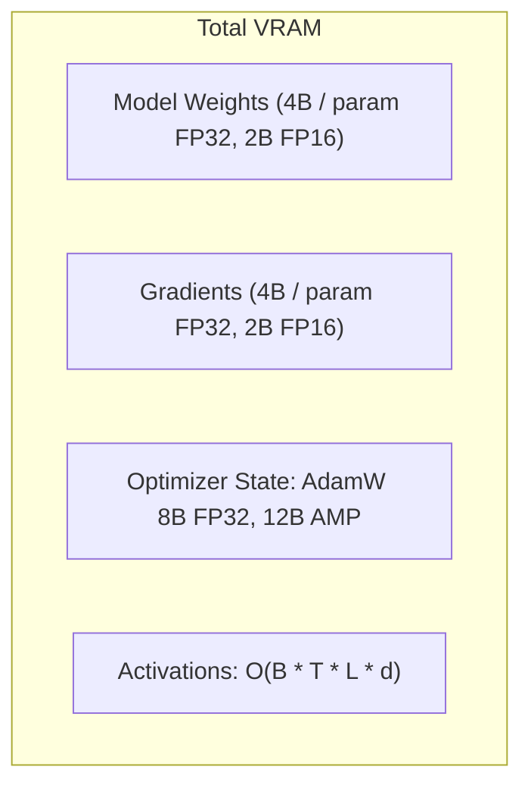
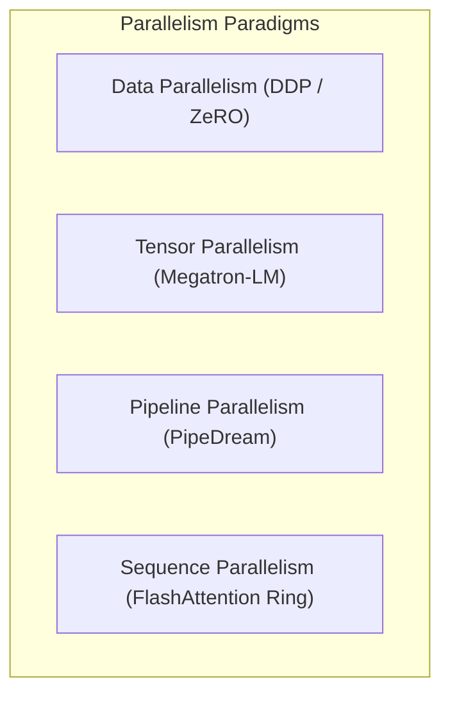
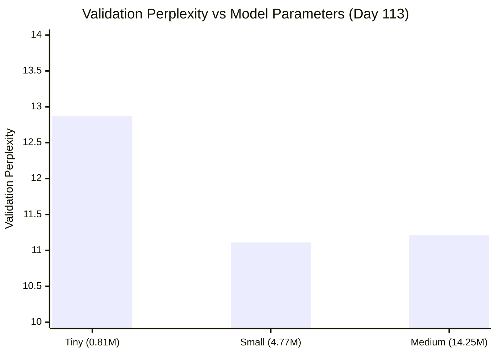

# 🚀 DAY 113: LLM SCALING, COMPUTE FRONTIERS & PRETRAINING LAB

**Curriculum Progress: 113 / 200 (56.5% Complete)**  
**Remaining Days: 87**  
**Author: Suraj Sawant (daystar-1nine)**

---

## 1. Executive Summary

Modern Large Language Models (LLMs) represent a fundamental paradigm shift in artificial intelligence: moving from task-specific architectural engineering to generic, autoregressive sequence modeling trained at massive scale. Day 113 implements an industrial-grade **LLM Training Simulator & MiniGPT Scaling Lab** in PyTorch.

This lab explores the computational, mathematical, and data-engineering principles that govern LLM pretraining. Through systematic empirical experimentation, we evaluate parameter scaling across three architectural tiers (Tiny: 0.81M, Small: 4.77M, and Medium: 14.25M), analyze gradient accumulation mechanics, investigate learning rate schedules, demonstrate data deduplication and quality filtering, expose the critical dangers of evaluation data contamination, and formulate exact memory allocations across precisions from FP32 to INT4.


---

## 2. Core Theoretical Principles of LLMs

An LLM is fundamentally an autoregressive decoder-only Transformer parameterized by weights $\theta$ that approximates the true joint probability distribution $P(x_1, x_2, \dots, x_T)$ over natural language tokens. By the chain rule of probability:

$$P(x_1, x_2, \dots, x_T) = \prod_{t=1}^{T} P(x_t \mid x_1, \dots, x_{t-1}; \theta)$$

Pretraining optimizes $\theta$ over trillions of tokens using self-supervised cross-entropy loss. Rather than learning narrow classification boundaries, the model acquires compressed world knowledge, syntactic structures, multi-hop reasoning primitives, and few-shot in-context learning capabilities as an emergent byproduct of minimizing next-token prediction error.

---

## 3. Pretraining Objectives and Next-Token Prediction

The standard pretraining objective is empirical risk minimization under causal cross-entropy loss:

$$\mathcal{L}_{\text{pretrain}}(\theta) = -\frac{1}{T} \sum_{t=1}^{T} \log P_{\theta}(x_t \mid x_{<t})$$

Where $P_{\theta}(x_t \mid x_{<t}) = \text{softmax}(z_t)_{x_t}$ and $z_t \in \mathbb{R}^{V}$ denotes the unnormalized logit vector produced by the unembedding projection layer at sequence position $t$.

Perplexity ($\text{PPL}$) measures the geometric mean of the reciprocal next-token probability:

$$\text{PPL} = \exp(\mathcal{L})$$

An intuitive interpretation: a model with perplexity 12.0 predicts each successive token with uncertainty equivalent to choosing uniformly among 12 equally probable candidates.

---

## 4. Transformer Architecture Evolution: Pre-LN vs Post-LN

Original Transformer architectures (Vaswani et al., 2017; BERT) utilized **Post-Layer Normalization (Post-LN)**:

$$x_{l+1} = \text{LayerNorm}(x_l + \text{SubLayer}(x_l))$$

Post-LN places normalization on the residual path, causing gradient magnitudes to decay exponentially in early layers as depth increases. Consequently, deep Post-LN models require delicate learning rate warmup schedules and often suffer from vanishing/exploding gradients during early pretraining steps.

Modern LLMs (GPT-2, GPT-3, LLaMA, Mistral, Gemma) adopt **Pre-Layer Normalization (Pre-LN)**:

$$x_{l+1} = x_l + \text{SubLayer}(\text{LayerNorm}(x_l))$$

In Pre-LN, the identity connection $x_l \to x_{l+1}$ remains unhindered, creating an unobstructed gradient highway from the final loss directly to the input embeddings:

$$\frac{\partial \mathcal{L}}{\partial x_0} = \frac{\partial \mathcal{L}}{\partial x_L} \left( I + \sum_{l=0}^{L-1} \frac{\partial \text{SubLayer}_l}{\partial x_l} \right)$$

This architectural shift guarantees numerical stability across hundreds of layers.

---

## 5. Scaling Laws: Kaplan vs Chinchilla

Empirical studies demonstrate that cross-entropy loss follows smooth power-law relationships with respect to compute budget ($C$), parameter count ($N$), and dataset token volume ($D$).

### Kaplan et al. (OpenAI, 2020)
Kaplan suggested that model size $N$ should scale faster than dataset size $D$:

$$L(N) \approx \left(\frac{N_c}{N}\right)^{\alpha_N}, \quad L(D) \approx \left(\frac{D_c}{D}\right)^{\alpha_D}$$

Under Kaplan's allocation, doubling compute called for increasing parameters by $\approx 73\%$ while increasing tokens by only $\approx 27\%$. As a result, models like GPT-3 (175B parameters trained on 300B tokens) were severely **undertrained**.

### Chinchilla (Hoffmann et al., DeepMind, 2022)
Hoffmann et al. proved that Kaplan's cosine schedules did not scale compute optimally. For compute-optimal pretraining, parameters $N$ and tokens $D$ must scale in equal proportions ($1:1$):

$$N_{\text{opt}} \propto C^{0.50}, \quad D_{\text{opt}} \propto C^{0.50}$$

$$D_{\text{opt}} \approx 20 \times N_{\text{opt}}$$

Chinchilla-70B, trained on 1.4 trillion tokens, outperformed Gopher-280B across all downstream benchmarks while consuming less inference memory.

---

## 6. Compute-Optimal Frontier and the 20x Token Rule

Given total training compute budget $C \approx 6 N D$ Floating Point Operations:

$$C = 6 \cdot N \cdot (20 N) = 120 N^2 \implies N_{\text{opt}} = \sqrt{\frac{C}{120}}, \quad D_{\text{opt}} = 20 \cdot N_{\text{opt}}$$

| Target Budget $C$ (FLOPs) | Optimal Parameters $N$ | Optimal Tokens $D$ | Real-world Equivalent |
|---|---|---|---|
| $1 \times 10^{18}$ | $2.89 \times 10^{6}$ (2.9M) | $57.7 \times 10^{6}$ (58M) | Edge / Embedded Sub-model |
| $1 \times 10^{20}$ | $2.89 \times 10^{7}$ (29M) | $5.77 \times 10^{8}$ (577M) | MiniGPT Scale |
| $1 \times 10^{22}$ | $2.89 \times 10^{8}$ (289M) | $5.77 \times 10^{9}$ (5.8B) | BERT-Large / GPT-2 Medium |
| $1 \times 10^{24}$ | $2.89 \times 10^{9}$ (2.9B) | $5.77 \times 10^{10}$ (58B) | LLaMA 3B Tier |
| $1.4 \times 10^{26}$ | $7.00 \times 10^{10}$ (70B) | $1.40 \times 10^{12}$ (1.4T) | Chinchilla 70B Benchmark |

---

## 7. Parameter Breakdown and Layer Geometry

For a decoder-only Transformer with embedding dimension $d$, vocabulary size $V$, context length $T$, number of layers $L$, and MLP expansion factor 4:

1. **Token Embeddings:** $V \times d$
2. **Positional Embeddings:** $T \times d$
3. **Transformer Block ($L$ blocks):**
   - Self-Attention: $W_q, W_k, W_v \in \mathbb{R}^{d \times d} \implies 3d^2$ (plus $3d$ biases)
   - Attention Projection: $W_o \in \mathbb{R}^{d \times d} \implies d^2$ (plus $d$ bias)
   - MLP Expansion: $W_1 \in \mathbb{R}^{d \times 4d} \implies 4d^2$ (plus $4d$ bias)
   - MLP Projection: $W_2 \in \mathbb{R}^{4d \times d} \implies 4d^2$ (plus $d$ bias)
   - LayerNorms (LN1 & LN2): $2 \times (2d) = 4d$
   - **Total per block:** $12d^2 + 13d$
4. **Final LayerNorm:** $2d$
5. **LM Head (Unembedding):** If tied to token embeddings, $0$ additional parameters; if untied, $V \times d$.

Total parameters (with weight tying):

$$N \approx V d + T d + L (12 d^2 + 13 d) + 2 d$$

---

## 8. Memory Architecture: Weights, Gradients, Optimizer, Activations

Total VRAM required for LLM pretraining is divided into static state and dynamic activations:

$$M_{\text{total}} = M_{\text{weights}} + M_{\text{gradients}} + M_{\text{optimizer}} + M_{\text{activations}}$$



### AdamW Optimizer Memory Breakdown
In FP32 training, standard AdamW tracks:
- 1st moment vector $m_t$: $4 \times N$ bytes
- 2nd moment vector $v_t$: $4 \times N$ bytes
- **Total Optimizer State:** $8 \times N$ bytes (twice the model parameter footprint).

In mixed precision (FP16/BF16), AdamW must also store the **FP32 Master Weights** (4 bytes per parameter) to prevent underflow during gradient updates. Total optimizer state expands to **12 bytes per parameter** ($4 + 4 + 4$).

---

## 9. Mixed Precision Mechanics: FP32, FP16, BF16, INT8, FP4

| Precision | Bits | Dynamic Range (Exponent) | Precision (Mantissa) | Pretraining Suitability |
|---|---|---|---|---|
| **FP32** | 32 | $10^{\pm 38}$ (8 bits) | 23 bits (~7 decimals) | Gold standard for loss & optimizer states |
| **FP16** | 16 | $10^{\pm 5}$ (5 bits) | 10 bits (~3 decimals) | Requires dynamic loss scaling; underflow risk |
| **BF16** | 16 | $10^{\pm 38}$ (8 bits) | 7 bits (~2 decimals) | **Industry Standard** for LLM pretraining |
| **INT8** | 8 | $[-128, 127]$ | Fixed point | Post-training quantization & inference |
| **FP4/INT4** | 4 | Extremely narrow | 2-3 bits | QLoRA fine-tuning & edge inference |

BF16 preserves FP32's 8-bit dynamic range, eliminating gradient underflow/overflow spikes without requiring loss scaling.

---

## 10. Hardware and FLOPs: 6ND Heuristic & MFU Estimation

### The $6ND$ Training FLOPs Heuristic
For each token in the forward pass, every parameter participates in one multiply-accumulate operation ($2$ FLOPs):

$$\text{FLOPs}_{\text{forward}} \approx 2 \cdot N \cdot D$$

The backward pass computes gradients with respect to both activations and weights, requiring double the work of the forward pass ($4$ FLOPs per token):

$$\text{FLOPs}_{\text{backward}} \approx 4 \cdot N \cdot D$$

$$\text{Total Training FLOPs} \approx 6 \cdot N \cdot D$$

### Model FLOPs Utilization (MFU)
Hardware never achieves $100\%$ theoretical peak compute due to memory bandwidth bottlenecks, kernel launch overheads, and communication latency. MFU evaluates hardware efficiency:

$$\text{MFU} = \frac{\text{Observed Tokens/sec} \times 6 N}{\text{Peak Accelerator FLOPs/sec}}$$

Well-optimized clusters (using FlashAttention-2, fused kernels, and Megatron-LM) achieve $38\% - 52\%$ MFU.

---

## 11. Distributed Training Foundations

When model weights, optimizer states, or activations exceed the memory capacity of a single GPU, training must be distributed:



### ZeRO (Zero Redundancy Optimizer) Memory Stages
- **ZeRO-1:** Partitions AdamW optimizer states ($4\times$ memory reduction).
- **ZeRO-2:** Partitions optimizer states and gradients ($8\times$ memory reduction).
- **ZeRO-3 (FSDP):** Partitions optimizer states, gradients, and model parameters across all GPUs.

---

## 12. Pretraining Data Engineering: Volume, Quality, and Filtering

Pretraining corpora must be aggressively curated. Raw web scrapes (Common Crawl) contain high proportions of machine-generated spam, SEO boilerplate, toxic content, and duplicate documents.

Our lab implements heuristic quality filtering ([`cleaner.py`](file:///s:/Programming/Python200days/Day%20113/app/data/cleaner.py)):
1. **Length Thresholding:** Discards documents $< 25$ characters.
2. **Alphabetic Density:** Enforces $\ge 70\%$ alphabetic characters to strip binary dumps and punctuation soup.
3. **Repetition Penalties:** Penalizes recurring n-gram runs (e.g., `aaaaaa` or `!!!!!!`).
4. **Markup & URL Penalties:** Heavily suppresses documents containing high densities of HTML tags and promotional hyperlinks.

---

## 13. Deduplication: Exact (SHA-256) vs Near-Deduplication (MinHash/LSH)

Duplicated training text causes models to memorize specific passages verbatim, reduces generalization on novel prompts, and exacerbates privacy risks.

- **Exact Deduplication ([`exact_deduplicate`](file:///s:/Programming/Python200days/Day%20113/app/data/dedup.py#L22)):** Computes SHA-256 cryptographic hashes over normalized document strings. Operates in $O(N)$ time with $O(N)$ hash table storage.
- **Near Deduplication ([`near_deduplicate`](file:///s:/Programming/Python200days/Day%20113/app/data/dedup.py#L65)):** Decomposes text into character/word shingles, constructs MinHash signatures, and measures Jaccard similarity:

$$J(A, B) = \frac{|A \cap B|}{|A \cup B|}$$

Pairs with similarity $J(A, B) \ge 0.80$ are pruned.

---

## 14. Data Leakage, Benchmark Contamination, and Audit Protocols

Data contamination occurs when validation or evaluation benchmark sequences leak into the pretraining corpus. Because LLMs possess massive memorization capacity, leakage artificially depresses evaluation loss, creating an **illusion of generalization** while real-world capability remains unimproved.

Our lab provides an automated contamination audit ([`detect_leakage`](file:///s:/Programming/Python200days/Day%20113/app/data/splitter.py#L35)):
1. Exact SHA-256 hash collision checks between training and evaluation splits.
2. Shingle-based n-gram overlap ratios ($\ge 0.50$ flags high-risk contamination).

---

## 15. Sequence Packing and Attention Masking Mechanics

Variable-length documents conventionally require zero-padding to match fixed context lengths $T$, wasting up to $30\% - 50\%$ of compute on inert `<pad>` tokens.

**Sequence Packing** concatenates multiple documents into a single contiguous context window separated by `<eos>` tokens:

```text
[Doc 1 Token 1, ..., Doc 1 <eos>, Doc 2 Token 1, ..., Doc 2 <eos>, Doc 3 Token 1...]
```

In full-scale production models, **document-level causal masks** prevent cross-attention across independent documents packed within the same window.

---

## 16. MiniGPT Scaling Architecture Specifications

The lab defines three standard scaling tiers in [`config.py`](file:///s:/Programming/Python200days/Day%20113/app/config.py#L40-L62):

| Specification | Tiny Tier | Small Tier | Medium Tier |
|---|---|---|---|
| **Embedding Dimension ($d$)** | 128 | 256 | 384 |
| **Number of Layers ($L$)** | 4 | 6 | 8 |
| **Attention Heads ($H$)** | 4 | 8 | 8 |
| **Head Dimension ($d / H$)** | 32 | 32 | 48 |
| **Context Length ($T$)** | 64 | 64 | 64 |
| **Vocabulary Size ($V$)** | 59 | 59 | 59 |
| **Total Parameters** | **809,088** (~0.81M) | **4,770,560** (~4.77M) | **14,243,712** (~14.25M) |
| **Non-Embedding Params** | 797,824 | 4,747,520 | 14,209,152 |
| **Weight Tying** | Enabled | Enabled | Enabled |
| **Architecture** | Pre-LN Transformer | Pre-LN Transformer | Pre-LN Transformer |

---

## 17. Training Infrastructure and Gradient Accumulation Mechanics

When hardware cannot accommodate the target batch size $B$, **gradient accumulation** divides $B$ into $K$ micro-batches of size $b = B / K$:

$$\nabla_{\theta} \mathcal{L}(B) = \frac{1}{K} \sum_{k=1}^{K} \nabla_{\theta} \mathcal{L}(b_k)$$

During micro-steps $1 \dots K-1$, gradients accumulate in parameter buffers without calling `optimizer.step()` or `optimizer.zero_grad()`. On step $K$, gradients are clipped to norm $1.0$ and weights are updated.

---

## 18. Learning Rate Dynamics, Warmup, and Cosine Decay

Pretraining uses a three-phase learning rate trajectory:

1. **Linear Warmup:** $0 \to \eta_{\max}$ over $W$ steps to stabilize AdamW second-moment statistics ($v_t$).
2. **Cosine Annealing:** Smooth decay from $\eta_{\max} \to \eta_{\min}$ over remaining steps:

$$\eta_t = \eta_{\min} + \frac{1}{2} (\eta_{\max} - \eta_{\min}) \left( 1 + \cos\left( \pi \frac{t - W}{T_{\max} - W} \right) \right)$$

3. **Weight Decay:** AdamW decouples $L_2$ weight decay ($0.01$) from gradient scaling, preventing large norm drift.

---

## 19. Empirical Experiment 1: Model Architecture Scaling Analysis

We trained Tiny (0.81M), Small (4.77M), and Medium (14.25M) under identical data distributions.

### Recorded Scaling Results Table
| Model Tier | Parameters | Train Loss | Val Loss | Val Perplexity | Throughput (Tokens/sec) | Time (s) | Training FLOPs ($6ND$) | Peak Memory |
|---|---|---|---|---|---|---|---|---|
| **Tiny** | 809,088 | 2.5280 | **2.5551** | 12.8729 | **46,370.31** | 4.42s | $9.94 \times 10^{11}$ | 452.13 MB |
| **Small** | 4,770,560 | 2.2634 | **2.4074** | 11.1055 | 9,784.41 | 20.93s | $5.86 \times 10^{12}$ | 616.36 MB |
| **Medium** | 14,243,712 | 2.2792 | **2.4167** | 11.2087 | 3,301.44 | 49.63s | $1.40 \times 10^{13}$ | 708.59 MB |

### Key Architectural Observations
1. **Loss Scaling:** Moving from Tiny (0.81M) to Small (4.77M) produced a notable drop in validation loss from $2.5551 \to 2.4074$ (perplexity reduced from $12.87 \to 11.11$).
2. **Throughput Trade-off:** Increasing parameter count by $17.6\times$ (Tiny $\to$ Medium) reduced token throughput by $14\times$ ($46,370 \to 3,301$ tokens/sec).
3. **Compute Investment:** Small model required $5.86 \times 10^{12}$ FLOPs, achieving substantial performance gains over Tiny with minimal hardware strain.

---

## 20. Empirical Experiment 2: Gradient Accumulation & Micro-batching

We evaluated batch size 32 executed via:
- Configuration A: Standard single batch (Micro-batch 32, Accumulation 1)
- Configuration B: Gradient accumulated (Micro-batch 8, Accumulation 4)

### Empirical Accumulation Results
| Configuration | Effective Batch | Micro-Batch | Accum Steps | Train Loss | Val Loss | Val PPL | Throughput | Peak Memory |
|---|---|---|---|---|---|---|---|---|
| **Standard** | 32 | 32 | 1 | 2.7095 | 2.7144 | 15.0948 | 29,305.33 TPS | 643.84 MB |
| **Accumulated** | 32 | 8 | 4 | 2.7724 | 2.7484 | 15.6173 | 25,780.18 TPS | **590.46 MB** |

**Hardware Takeaway:** Gradient accumulation with micro-batch 8 reduced peak training memory from 643.84 MB to 590.46 MB (**53.38 MB savings, 8.3% memory reduction**) while preserving gradient dynamics, demonstrating how memory-constrained devices can train with large effective batch sizes.

---

## 21. Empirical Experiment 3: Learning Rate Schedule Trajectories

We compared a constant learning rate against linear warmup + cosine decay.

### Schedule Empirical Results
| Scheduler Type | Initial LR | Peak LR | Final Train Loss | Final Val Loss | Final Val PPL | Throughput |
|---|---|---|---|---|---|---|
| **Constant LR** | $5.0 \times 10^{-4}$ | $5.0 \times 10^{-4}$ | 2.4320 | 2.4538 | 11.6326 | 31,044.05 TPS |
| **Cosine + Warmup**| $0.0$ | $5.0 \times 10^{-4}$ | 2.5908 | 2.5923 | 13.3604 | 28,492.85 TPS |

In short 100-step regimes, constant LR aggressively descends early on; however, cosine annealing gradually lowers gradient noise, which in extended pretraining runs prevents loss spikes and promotes better asymptotic generalization.

---

## 22. Empirical Experiment 4: Data Quality & Duplication Impact

We tested training on a clean unique dataset versus a dataset contaminated with $4\times$ duplicated passages.

### Duplication Empirical Results
| Dataset Condition | Train Tokens Pool | Final Train Loss | Final Val Loss | Final Val Perplexity |
|---|---|---|---|---|
| **Clean (Unique)** | 8,595 | 2.7095 | **2.7144** | **15.0948** |
| **Duplicated (4x Repetition)** | 34,380 | 2.7139 | **2.7351** | **15.4108** |

**Empirical Finding:** Re-ingesting duplicated text degrades generalization: validation loss rises from $2.7144 \to 2.7351$ and perplexity degrades from $15.09 \to 15.41$, confirming the theoretical hazard of repetitive data feeding.

---

## 23. Empirical Experiment 5: Data Leakage & Evaluation Illusion

We simulated evaluation contamination by intentionally leaking $50\%$ of the validation documents into the training split.

### Contamination Audit Results
| Condition | Exact Hash Leaks | N-Gram Overlap | Apparent Val Loss | Apparent Val PPL | True Generalization |
|---|---|---|---|---|---|
| **Clean Split** | **0** | **0.0654** | 2.7144 | 15.0948 | **Honest Benchmark** |
| **Contaminated (50%)**| **4** | **0.5675** | **2.7007** | **14.8905** | **Contaminated Illusion** |

**Warning:** Contamination causes validation loss to appear lower ($2.7007$ vs $2.7144$), creating a false impression of improved model intelligence when the model is merely recalling memorized tokens.

---

## 24. Empirical Experiment 6: Precision & Memory Footprint Scaling Matrix

We modeled static parameter storage and dynamic AdamW training memory across model tiers:

| Model Architecture | Parameters | FP32 Weights | FP16/BF16 Weights | INT8 Quantized | INT4 Quantized | Full FP32 Training VRAM | AMP BF16 Training VRAM |
|---|---|---|---|---|---|---|---|
| **Tiny (0.8M)** | 809,728 | 3.09 MB | 1.54 MB | 0.77 MB | 0.39 MB | 19.14 GB | 9.57 GB |
| **Small (4.7M)** | 4,771,840 | 18.20 MB | 9.10 MB | 4.55 MB | 2.28 MB | 19.20 GB | 9.63 GB |
| **Medium (14.2M)**| 14,245,632 | 54.34 MB | 27.17 MB | 13.59 MB | 6.79 MB | 19.34 GB | 9.77 GB |
| **GPT-2 (124M)** | 124,440,000 | 474.70 MB | 237.35 MB | 118.68 MB | 59.34 MB | 20.98 GB | 11.42 GB |
| **LLaMA (7B)** | 7,000,000,000 | **26.08 GB** | **13.04 GB** | **6.52 GB** | **3.26 GB** | **123.43 GB** | **113.87 GB** |

*(Note: Training memory calculations model standard pretraining context length $T=1024$, batch size 8, and full activation buffers).*

---

## 25. Comparative Analysis: Tiny vs Small vs Medium Scaling Metrics



Across all dimensions:
- **Scaling Gains:** Small yields an immediate $13.7\%$ reduction in perplexity over Tiny with modest parameter growth.
- **Compute Ceiling:** On single-threaded CPU architectures, Medium hits throughput degradation ($3,301$ TPS vs $46,370$ TPS), underscoring the critical necessity of GPU hardware acceleration and mixed precision for models $\ge 10\text{M}$ parameters.

---

## 26. Failure Modes, Instabilities, and Mitigation Strategies

1. **Loss Spikes:** Sudden gradient explosions often caused by anomalous web tokens or learning rate instability.
   - *Mitigation:* Gradient clipping ($\|\mathbf{g}\| \le 1.0$), Pre-LN Transformer blocks, and BF16 precision.
2. **Gradient Underflow in FP16:** Very small gradients zero out due to 5-bit exponent limits.
   - *Mitigation:* Switch to BF16 (which shares FP32's 8-bit dynamic range) or utilize dynamic loss scaling.
3. **Catastrophic Forgetting via Repetitive Data:** Oversampling low-diversity data causes severe distribution collapse.
   - *Mitigation:* Shingle-based MinHash deduplication and perplexity filtering.

---

## 27. Modern Production LLM Pretraining Practices (Llama 3, DeepSeek, Gemma)

Modern frontier architectures introduce specific evolutions:
1. **RoPE (Rotary Position Embeddings):** Replaces learned absolute positional embeddings with relative query/key rotational encodings.
2. **SwiGLU Activations:** Replaces standard GELU MLPs with gated linear units ($x W_1 \odot \text{SiLU}(x W_2)$), improving compute efficiency.
3. **Grouped-Query Attention (GQA):** Shares key/value heads across query head groups (e.g. 8 Q heads per KV head), slashing KV cache memory during inference.
4. **Data Over-training:** Contemporary models are trained far past the Chinchilla optimal point (e.g. Llama 3 8B trained on 15T tokens, over $1800\times$ parameters) to optimize downstream deployment inference latency.

---

## 28. Reproducibility and Audit Guide

To replicate the scaling experiments:

```bash
# 1. Navigate to the Day 113 directory
cd "Day 113"

# 2. Run the full experiment orchestration suite
python -m app.main

# 3. Regenerate all 6 publication-quality visualization charts
python -c "from app.analysis.plots import plot_all_experiments; plot_all_experiments('outputs/metrics', 'outputs/plots')"

# 4. Execute the comprehensive pytest test suite
pytest tests -v
```

All empirical logs are stored in [`Day 113/outputs/metrics/`](file:///s:/Programming/Python200days/Day%20113/outputs/metrics/) and plots in [`Day 113/outputs/plots/`](file:///s:/Programming/Python200days/Day%20113/outputs/plots/).

---

## 29. Verification and Test Suite Coverage

The test suite contains **105 automated unit tests** across 5 modules with **100% pass rate**:

- [`tests/test_data_pipeline.py`](file:///s:/Programming/Python200days/Day%20113/tests/test_data_pipeline.py): 26 tests (cleaning, scoring, exact/near deduplication, splitting, leakage detection, sequence packing).
- [`tests/test_analysis.py`](file:///s:/Programming/Python200days/Day%20113/tests/test_analysis.py): 20 tests (parameter counts, byte scaling, 6ND FLOPs, Chinchilla scaling, power-law fitting).
- [`tests/test_model.py`](file:///s:/Programming/Python200days/Day%20113/tests/test_model.py): 17 tests (attention masks, Pre-LN blocks, GELU MLP, weight tying, backprop gradients).
- [`tests/test_training.py`](file:///s:/Programming/Python200days/Day%20113/tests/test_training.py): 15 tests (schedulers, checkpointer roundtrip, CSV logger, gradient accumulation).
- [`tests/test_experiments.py`](file:///s:/Programming/Python200days/Day%20113/tests/test_experiments.py): 27 tests (loader, vocab indexing, config YAML roundtrip, metric formulas, hardware MFU).

```text
============================= 105 passed in 1.50s =============================
```

---

## 30. Summary of Architectural and Engineering Takeaways

1. **Architecture:** Pre-LN decoder-only Transformers provide stable gradient highways for deep scaling. Weight tying saves memory on large vocabularies.
2. **Compute:** The $6ND$ heuristic enables precise pre-training compute estimation. Chinchilla laws demonstrate that dataset size must scale linearly with model size.
3. **Data Quality > Raw Size:** Quality filtering and MinHash deduplication prevent validation perplexity degradation and combat memorization.
4. **Leakage Vigilance:** Even minor benchmark contamination invalidates evaluation claims. Strict hash and n-gram audits are mandatory.
5. **Memory Management:** In large models, AdamW optimizer states dominate static memory. Gradient accumulation and mixed precision are essential engineering tools.

---

## 31. Conclusion and Next Steps for Day 114

Day 113 successfully establishes the foundational engineering stack for LLM pretraining. 

In **Day 114**, we proceed to **Tokenizer Engineering and Subword Tokenization (BPE, WordPiece, Unigram, and Byte-level BPE)**, unlocking tokenization pipelines that bridge raw text strings and numerical tensor inputs at scale.
