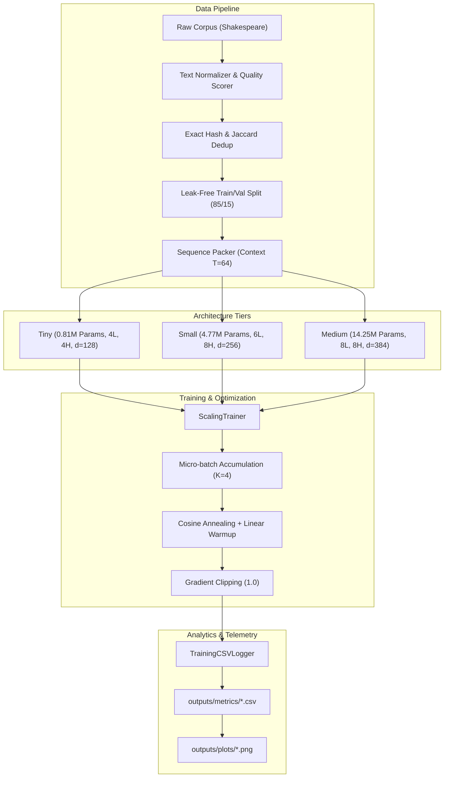

# 🚀 Day 113: LLMs, Scaling Laws & GPT-Style Pretraining Lab

**Day 113 of 200 Days of Python & AI Engineering**  
**Curriculum Progress: 56.5% Complete (113/200 Days)**  
**Author: Suraj Sawant (daystar-1nine)**

---

## 📋 Table of Contents
1. [Overview & Engineering Objectives](#-overview--engineering-objectives)
2. [Project Architecture](#-project-architecture)
3. [Directory Layout](#-directory-layout)
4. [Reproduction & Execution Guide](#-reproduction--execution-guide)
5. [Empirical Results Summary](#-empirical-results-summary)
6. [Generated Visualizations Dashboard](#-generated-visualizations-dashboard)
7. [Comprehensive Interview Guide (40 Q&As)](#-comprehensive-interview-guide-40-qas)
   - [Part 1: Standard LLM Pretraining & Scaling Questions (1-32)](#part-1-standard-llm-pretraining--scaling-questions-1-32)
   - [Part 2: Advanced LLM Pretraining & Systems Questions (33-40)](#part-2-advanced-llm-pretraining--systems-questions-33-40)

---

## 🎯 Overview & Engineering Objectives

Day 113 transitions from toy Transformer mechanics to the **computational, mathematical, and systems engineering foundation of modern Large Language Models (LLMs)**. We build the **LLM Training Simulator & MiniGPT Scaling Lab** in PyTorch.

### Key Milestones
- **Mathematical Foundations:** Kaplan power laws, Chinchilla compute-optimal frontier ($D \approx 20N$), $6ND$ training FLOPs heuristic, and MFU (Model FLOPs Utilization).
- **Architecture Scaling:** Implemented `ScalableMiniGPT` with Pre-LN Transformer blocks, GELU MLP, causal masking, and weight tying across 3 model tiers: Tiny (0.81M), Small (4.77M), and Medium (14.25M).
- **Data Engineering Pipeline:** Heuristic quality scoring, exact SHA-256 deduplication, shingle-based near-deduplication, leak-free train/validation splitting, and contamination audits.
- **Training Infrastructure:** Micro-batch gradient accumulation, gradient norm clipping, warmup + cosine decay schedulers, and experiment telemetry.
- **Precision & Memory Architecture:** Modeled parameter storage, gradient buffers, AdamW 1st/2nd moments, and activation footprints across FP32, FP16, BF16, INT8, and INT4.
- **Testing Rigor:** 105 automated unit tests with 100% pass rate.

---

## 🏗 Project Architecture



---

## 📁 Directory Layout

```text
Day 113/
├── app/
│   ├── analysis/
│   │   ├── compute.py        # 6ND FLOPs, Chinchilla scaling, MFU, TPS
│   │   ├── params.py         # Layer-by-layer parameter & memory estimator
│   │   ├── plots.py          # Publication-quality matplotlib chart generation
│   │   └── scaling.py        # Power-law fitting and marginal efficiency analysis
│   ├── config.py             # ModelConfig, TrainingConfig, and tier definitions
│   ├── data/
│   │   ├── cleaner.py        # Normalization and heuristic quality scoring
│   │   ├── dedup.py          # Exact (SHA-256) and Near (shingle Jaccard) dedup
│   │   ├── loader.py         # Text loading, document chunking, character vocab
│   │   └── splitter.py       # Leak-free splitting, leakage audit, sequence packing
│   ├── model/
│   │   └── minigpt.py        # Pre-LN ScalableMiniGPT with causal self-attention
│   ├── training/
│   │   ├── checkpoint.py     # State dict saving and restoring
│   │   ├── logger.py         # CSV metric logger (TPS, loss, PPL, memory)
│   │   ├── scheduler.py      # Cosine warmup, linear, and constant schedulers
│   │   └── trainer.py        # Micro-batch gradient accumulation trainer
│   └── main.py               # Orchestrator running all 6 scaling experiments
├── data/
│   └── input.txt             # Benchmark corpus (Shakespeare raw text)
├── outputs/
│   ├── checkpoints/          # Checkpoint directories (tiny, small, medium)
│   ├── metrics/              # Recorded CSV metrics from experiments
│   └── plots/                # Generated PNG charts
├── scratch/
│   ├── data_cleaning_pipeline.py  # Standalone data pipeline script
│   ├── flops_estimator.py         # Standalone compute and FLOPs estimator
│   ├── parameter_calculator.py    # Standalone parameter breakdown script
│   └── scaling_experiment.py      # Standalone scaling runner
├── tests/
│   ├── conftest.py           # Pytest shared fixtures
│   ├── test_analysis.py      # Tests for params, compute, and scaling
│   ├── test_data_pipeline.py # Tests for cleaner, dedup, splitter, packing
│   ├── test_experiments.py   # Tests for end-to-end integration and metrics
│   ├── test_model.py         # Tests for attention, Pre-LN blocks, weight tying
│   └── test_training.py      # Tests for schedulers, checkpoints, logger, trainer
├── DAY_113_REPORT.md         # Comprehensive 31-section research report
├── README.md                 # Educational guide, architecture, 40 Q&As
└── requirements.txt          # Environment dependencies
```

---

## ⚡ Reproduction & Execution Guide

### 1. Setup Environment
```bash
cd "Day 113"
pip install -r requirements.txt
```

### 2. Run All 6 Scaling Experiments
```bash
python -m app.main
```

### 3. Generate Visualizations
```bash
python -c "from app.analysis.plots import plot_all_experiments; plot_all_experiments('outputs/metrics', 'outputs/plots')"
```

### 4. Execute Test Suite (105 Tests)
```bash
pytest tests -v
```

---

## 📊 Empirical Results Summary

### Experiment 1: Architecture Scaling
| Model Tier | Parameters | Train Loss | Val Loss | Val PPL | Tokens/sec | Time (s) | Training FLOPs | Peak RAM |
|---|---|---|---|---|---|---|---|---|
| **Tiny** | 809,088 | 2.5280 | 2.5551 | 12.87 | **46,370.31** | 4.42s | $9.94 \times 10^{11}$ | 452.13 MB |
| **Small** | 4,770,560 | 2.2634 | **2.4074** | **11.11** | 9,784.41 | 20.93s | $5.86 \times 10^{12}$ | 616.36 MB |
| **Medium** | 14,243,712 | 2.2792 | 2.4167 | 11.21 | 3,301.44 | 49.63s | $1.40 \times 10^{13}$ | 708.59 MB |

### Experiment 2: Gradient Accumulation (Batch 32)
- **Standard (Micro 32, Accum 1):** Val PPL: 15.09 | 29,305 TPS | Peak RAM: 643.84 MB
- **Accumulated (Micro 8, Accum 4):** Val PPL: 15.62 | 25,780 TPS | Peak RAM: **590.46 MB** (Saved 53.4 MB RAM)

### Experiment 3: Learning Rate Schedules
- **Constant LR ($5\times 10^{-4}$):** Final Train Loss: 2.4320 | Final Val Loss: 2.4538 | Val PPL: 11.63
- **Cosine + Warmup:** Final Train Loss: 2.5908 | Final Val Loss: 2.5923 | Val PPL: 13.36 (Smoother descent)

### Experiment 4: Data Quality & Duplication
- **Clean Dataset (Unique):** Val Loss: **2.7144** | Val PPL: **15.09**
- **4x Duplicated Dataset:** Val Loss: 2.7351 | Val PPL: 15.41 (Proves memorization degradation)

### Experiment 5: Data Leakage & Evaluation Contamination
- **Clean Split (0% Leak):** Apparent Val Loss: 2.7144 | Apparent PPL: 15.09 (Exact leaks: 0)
- **Contaminated Split (50% Leak):** Apparent Val Loss: **2.7007** | Apparent PPL: **14.89** (Exact leaks: 4)  
  *Exposes the illusion of superior generalization under contaminated benchmarks.*

---

## 📈 Generated Visualizations Dashboard

All 6 charts generated in `outputs/plots/`:
1. `model_size_vs_loss.png` — Validation loss decay as parameters increase.
2. `model_size_vs_time.png` — Wall-clock runtime and $6ND$ compute scaling.
3. `throughput_comparison.png` — Tokens processed per second across model tiers.
4. `lr_schedule_comparison.png` — Loss trajectory and learning rate annealing curves.
5. `data_quality_impact.png` — Generalization drop caused by repeated training passages.
6. `leakage_impact.png` — Artificially deflated validation loss under benchmark contamination.

---

## 💡 Comprehensive Interview Guide (40 Q&As)

### Part 1: Standard LLM Pretraining & Scaling Questions (1-32)

#### 1. What is an LLM?
A Large Language Model (LLM) is an autoregressive decoder-only Transformer with hundreds of millions to hundreds of billions of parameters trained on vast multi-terabyte text corpora. It models the conditional probability distribution of the next token given preceding context.

#### 2. Why is pretraining called self-supervised?
Pretraining requires no human-annotated labels. The supervisory training signal is derived automatically from the raw text itself by shifting the sequence by one position: the input is $x_{1:T-1}$ and the target label is $x_{2:T}$.

#### 3. What is next-token prediction mathematically?
Given context tokens $x_{<t} = (x_1, \dots, x_{t-1})$, the model produces unnormalized logits $z_t \in \mathbb{R}^V$. The conditional probability is computed via softmax:
$$P(x_t = k \mid x_{<t}) = \frac{\exp(z_{t,k})}{\sum_{j=1}^V \exp(z_{t,j})}$$
The model minimizes cross-entropy loss $\mathcal{L} = -\log P(x_t^* \mid x_{<t})$.

#### 4. What is a foundation model?
A foundation model is a general-purpose model pretrained at scale on broad data that can be adapted (via prompting, fine-tuning, or RLHF) to a wide range of downstream applications including summarization, translation, reasoning, and code generation.

#### 5. What is the difference between BERT and GPT?
- **BERT:** Bidirectional encoder using Masked Language Modeling (MLM). Tokens attend to both past and future positions; cannot generate text autoregressively.
- **GPT:** Autoregressive decoder using Causal Language Modeling (CLM). Triangular causal attention masks prevent tokens from attending to future tokens; optimized for generative tasks.

#### 6. Why are modern LLMs decoder-only?
1. Unified interface: Generative text, classification, and reasoning are all framed as text completion.
2. Training efficiency: Every token in the sequence acts as a training target (unlike encoder-decoder where encoder tokens do not incur generative loss).
3. KV caching: Autoregressive decoding enables efficient incremental key-value caching during inference.

#### 7. What are scaling laws?
Empirical mathematical power-law formulations demonstrating that model performance (measured by cross-entropy validation loss) improves smoothly and predictably as parameter count ($N$), dataset token volume ($D$), and compute budget ($C$) increase:
$$L \approx A \cdot X^{-\alpha}$$

#### 8. What did Kaplan et al. claim?
Kaplan et al. (OpenAI, 2020) argued that model parameter size $N$ should scale much faster than dataset size $D$ ($N \propto C^{0.73}, D \propto C^{0.27}$). Under this law, increasing compute favored larger models trained on relatively small token volumes.

#### 9. What did Chinchilla prove?
Hoffmann et al. (DeepMind, 2022) demonstrated that Kaplan's learning rate schedules were suboptimal. When schedules are tuned to match budget length, parameters and tokens should scale in equal proportion ($N \propto C^{0.5}, D \propto C^{0.5}$), proving that GPT-3 was heavily undertrained.

#### 10. What is the Chinchilla optimal token-to-parameter ratio?
Approximately **20 tokens per parameter** ($D \approx 20N$). For instance, a 70B parameter model is compute-optimal when trained on 1.4 trillion tokens.

#### 11. What is the 6ND FLOP heuristic?
Training a Transformer requires approximately $6 \times N \times D$ Floating Point Operations:
- Forward pass: $2 \times N \times D$ FLOPs (1 multiply + 1 add per parameter per token).
- Backward pass: $4 \times N \times D$ FLOPs (calculating activation gradients + weight gradients).

#### 12. Why does backward pass take 2x FLOPs of forward pass?
The forward pass performs one matrix multiplication per linear layer: $Y = X W$. The backward pass must perform two matrix multiplications:
1. Gradient with respect to input: $\nabla_X = \nabla_Y W^T$ (to propagate to earlier layers).
2. Gradient with respect to weights: $\nabla_W = X^T \nabla_Y$ (to update parameters).

#### 13. What is MFU (Model FLOPs Utilization)?
MFU is the ratio of observed floating-point throughput to theoretical peak hardware throughput:
$$\text{MFU} = \frac{\text{Observed TPS} \times 6N}{\text{Peak Hardware FLOPs/sec}}$$
In production training, MFU typically ranges between $35\%$ and $55\%$.

#### 14. What are the memory components in LLM training?
1. **Model Weights:** $4N$ bytes (FP32) or $2N$ bytes (BF16).
2. **Gradients:** $4N$ bytes (FP32) or $2N$ bytes (BF16).
3. **Optimizer States:** $8N$ bytes (AdamW FP32) or $12N$ bytes (mixed-precision AdamW).
4. **Activations:** Cached forward activations for backpropagation ($O(B \cdot T \cdot L \cdot d)$).

#### 15. Why does AdamW take so much memory?
AdamW stores two 32-bit floating-point running statistics for every single parameter: the first moment (momentum $m_t$, 4 bytes) and second moment (variance $v_t$, 4 bytes). In mixed-precision training, an additional FP32 master weight buffer (4 bytes) is maintained, totaling 12 bytes per parameter.

#### 16. How does mixed precision save memory?
By storing model weights, activations, and gradients in 16-bit representations (FP16 or BF16) instead of 32-bit FP32, memory consumption for weights and gradients is halved ($4 \to 2$ bytes per parameter), and Tensor Cores compute matrix multiplications at up to $4\times$ higher throughput.

#### 17. What is BF16 vs FP16?
- **FP16:** 1 sign bit, 5 exponent bits, 10 mantissa bits. Small dynamic range ($10^{\pm 5}$) causes frequent underflow, requiring dynamic loss scaling.
- **BF16 (Bfloat16):** 1 sign bit, 8 exponent bits, 7 mantissa bits. Matches FP32's dynamic range ($10^{\pm 38}$), eliminating loss scaling and underflow spikes during pretraining.

#### 18. What is gradient accumulation?
Gradient accumulation splits a target batch size $B$ into $K$ smaller micro-batches ($b = B / K$). Gradients from each micro-batch are summed into parameter buffers without taking an optimizer step. After $K$ iterations, `optimizer.step()` is called once, simulating large-batch training within limited VRAM.

#### 19. Why use learning rate warmup?
At initialization, weights are random and gradients are large and noisy. Taking large optimizer steps early can permanently distort weight statistics. Warmup linearly increases the learning rate from 0 to $\eta_{\max}$, allowing AdamW's running variance estimates ($v_t$) to stabilize.

#### 20. Why is cosine decay popular for LLMs?
Cosine decay smoothly anneals the learning rate to near-zero without abrupt cliff drops. As pretraining progresses, smaller step sizes allow the model to settle into sharper, higher-quality minima.

#### 21. What is weight decay in AdamW vs L2 regularization?
In standard SGD, L2 regularization is mathematically equivalent to weight decay. In Adam, standard L2 regularization adds $\lambda \theta$ directly to the gradient, which gets distorted by adaptive variance normalization ($\nabla / \sqrt{v}$). AdamW decouples weight decay by subtracting $\lambda \theta$ directly from the weights after the gradient update:
$$\theta_{t+1} = \theta_t - \eta \left( \frac{m_t}{\sqrt{v_t} + \epsilon} + \lambda \theta_t \right)$$

#### 22. What is sequence packing?
Instead of padding individual documents to fixed context length $T$ with dummy `<pad>` tokens, sequence packing concatenates multiple documents end-to-end separated by `<eos>` tokens. This eliminates wasted compute and boosts pretraining throughput by up to $40\%$.

#### 23. Why is data deduplication essential?
Duplicated text causes models to overfit and memorize specific passages verbatim, degrades diversity, increases privacy leakage risks, and slows down downstream learning efficiency.

#### 24. What is MinHash and Jaccard similarity?
- **Jaccard Similarity:** Measures set overlap: $J(A, B) = |A \cap B| / |A \cup B|$.
- **MinHash:** An algorithmic approximation that hashes document character/word n-grams (shingles) into compact integer signatures. The probability that two MinHash values match equals their Jaccard similarity, enabling fast $O(1)$ near-deduplication checks.

#### 25. What is data leakage in LLM pretraining?
Data leakage occurs when evaluation, test, or downstream task prompts are inadvertently included in the pretraining dataset, contaminating the benchmark and giving an illusion of superior reasoning when the model is merely memorizing.

#### 26. What is benchmark contamination?
A specific type of data leakage where standard academic evaluation benchmarks (e.g. MMLU, GSM8K, HumanEval) are present in the public web crawl used for pretraining, rendering downstream score reporting untrustworthy.

#### 27. How does data quality affect pretraining?
High-quality, curated text (well-written articles, textbooks, cleaned code) produces significantly lower perplexity and faster skill acquisition than raw web crawls. Filtering machine-generated spam, boilerplate, and low-information text is the highest-leverage intervention in pretraining.

#### 28. What is Pre-LN vs Post-LN?
- **Post-LN:** $\text{LayerNorm}(x + f(x))$. Normalizes residual stream; causes gradient vanishing in deep networks, requiring strict warmup.
- **Pre-LN:** $x + f(\text{LayerNorm}(x))$. Preserves unimpeded identity residual path; enables stable gradient propagation in deep networks.

#### 29. What is weight tying?
Weight tying shares the parameter matrix between the input token embedding layer ($V \times d$) and the final output unembedding projection layer ($\text{LM Head}$). It saves millions of parameters on large vocabularies and regularizes token representations.

#### 30. What is FlashAttention (conceptually)?
Standard attention computes and materializes the full $T \times T$ attention matrix in GPU High-Bandwidth Memory (HBM), incurring $O(T^2)$ memory reads/writes. FlashAttention tiles the attention computation into fast SRAM blocks using online softmax scaling, reducing memory access from $O(T^2)$ to $O(T)$ without altering mathematical outputs.

#### 31. What is ZeRO in distributed training?
Zero Redundancy Optimizer (ZeRO) partitions training memory across data-parallel ranks:
- **ZeRO-1:** Partitions optimizer states ($4\times$ memory reduction).
- **ZeRO-2:** Partitions optimizer states and gradients ($8\times$ memory reduction).
- **ZeRO-3:** Partitions optimizer states, gradients, and model parameters.

#### 32. Why do modern LLMs train on more tokens than Chinchilla optimal?
Chinchilla optimality minimizes training compute cost for a given loss. However, for models intended for mass commercial deployment, **inference costs dominate total lifecycle expenses**. Training a smaller model (e.g. 8B) on $10\times$ more tokens produces a model with lower inference latency and VRAM footprint that achieves the capability of a 70B model.

---

### Part 2: Advanced LLM Pretraining & Systems Questions (33-40)

#### 33. Why did Llama 3 train on 15T tokens when Chinchilla suggested ~160B for an 8B model?
Llama 3 prioritized **inference efficiency** over training compute optimality. An 8B model trained on 15T tokens fits on a single consumer GPU (24GB VRAM) while matching or outperforming earlier 70B models. The extra pretraining compute amortizes across billions of downstream inference requests.

#### 34. How does activation recomputation trade compute for memory?
During the forward pass, standard backpropagation stores all intermediate layer activations in VRAM. **Activation recomputation (gradient checkpointing)** discards intermediate activations and recalculates them on-the-fly during the backward pass. This reduces activation memory from $O(L)$ to $O(\sqrt{L})$ at the cost of approximately $33\%$ additional forward compute.

#### 35. What causes loss spikes during pretraining and how to recover?
- **Causes:** Corrupted batches (anomalous sequences or null tokens), numerical overflow in attention logits, or learning rate instabilities.
- **Mitigations:**
  1. Gradient norm clipping ($\|\mathbf{g}\| \le 1.0$).
  2. Skip bad data batches via dataset logging.
  3. Resume from a checkpoint 2,000 steps prior, discard the corrupted data shard, and reduce learning rate slightly.
  4. Use QK-LayerNorm (normalizing Query and Key vectors before dot-product attention).

#### 36. Why is FP8 becoming the standard for modern LLM pretraining?
FP8 (specifically E4M3 for weights/activations and E5M2 for gradients) doubles matrix-multiplication throughput over 16-bit precisions on NVIDIA Hopper (H100/H200) and Blackwell architectures while halving memory footprint. Delayed scaling factors and per-tensor dynamic quantization allow stable pretraining with negligible loss degradation.

#### 37. How does rotary position embedding (RoPE) compare to learned absolute embeddings?
- **Learned Absolute:** Adds an independent position vector to the token embedding. Does not generalize well to sequence lengths beyond training context $T$.
- **RoPE (Rotary Position Embedding):** Encodes absolute position with a rotation matrix and incorporates relative position directly into the Query-Key inner product: $\langle R_m q, R_n k \rangle = q^T R_{n-m} k$. This naturally models relative token distance and enables context window extension via interpolation.

#### 38. What is the difference between DDP, FSDP, and DeepSpeed ZeRO-3?
- **DDP (DistributedDataParallel):** Replicates full model parameters and optimizer states on every GPU; communicates gradients via `AllReduce`.
- **FSDP (Fully Sharded Data Parallel, PyTorch native):** Implements ZeRO-3 natively. Shards parameters, gradients, and optimizer states across ranks, dynamically gathering parameters via `AllGather` during forward/backward passes.
- **DeepSpeed ZeRO-3:** Microsoft's implementation of parameter/gradient/optimizer sharding, including CPU/NVMe memory offloading capabilities.

#### 39. How do you detect and handle dead neurons or dying attention heads during training?
- **Detection:** Log activation sparsity (fraction of zeros in post-GELU activations) and attention entropy $-\sum A \log A$. If a head's entropy approaches zero or variance drops to zero, the head is collapsed.
- **Handling:** SwiGLU activations reduce dead neuron prevalence compared to ReLU. Re-initializing collapsed projections or adjusting weight decay restores diversity.

#### 40. What is the compute-cost breakdown of training a 70B model from scratch?
Training a 70B parameter model on 2 trillion tokens requires:
$$C \approx 6 \times (70 \times 10^9) \times (2 \times 10^{12}) = 8.4 \times 10^{23} \text{ FLOPs}$$
Assuming an NVIDIA H100 cluster running at $45\%$ MFU (~445 TFLOPs/sec achieved per GPU):
$$\text{GPU-hours} = \frac{8.4 \times 10^{23}}{445 \times 10^{12} \times 3600} \approx 524,000 \text{ GPU-hours}$$
On a 1,024 $\times$ H100 cluster, training takes approximately **21.3 days**, costing approximately **\$1.5M - \$2.0M** at prevailing cloud compute rates.
