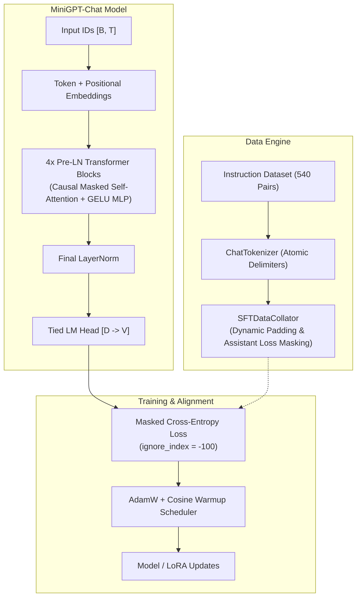

# 🚀 Day 114: Instruction Fine-Tuning & Chat Models (MiniGPT-Chat)

[-blue.svg)](#)
[](#)
[](#)
[](#)
[-purple.svg)](#)

Welcome to **Day 114 of 200 Days of Python & Deep Learning**. Today, we bridge the foundational gap between raw autoregressive next-token prediction and instruction-following conversational AI by building **MiniGPT-Chat** from scratch in PyTorch.

---

## 📌 Table of Contents
1. [Day 114 Mission & Overview](#-day-114-mission--overview)
2. [Core Architecture & Technical Pipeline](#-core-architecture--technical-pipeline)
3. [The Mathematics of Assistant-Only Loss Masking](#-the-mathematics-of-assistant-only-loss-masking)
4. [Low-Rank Adaptation (LoRA) Deep Dive](#-low-rank-adaptation-lora-deep-dive)
5. [Empirical Experimental Results](#-empirical-experimental-results)
6. [Interactive Chat Terminal](#-interactive-chat-terminal)
7. [Comprehensive Verification (106 Tests)](#-comprehensive-verification-106-tests)
8. [40 Technical Interview Questions & Answers](#-40-technical-interview-questions--answers)

---

## 🎯 Day 114 Mission & Overview

A raw base language model is purely an autoregressive document completer. When given a query like:
```text
User: What is photosynthesis?
```
A base model often responds by generating more questions:
```text
User: What is cellular respiration?
User: What is the citric acid cycle?
```
**Instruction Fine-Tuning (Supervised Fine-Tuning, or SFT)** teaches the model the **assistant role**—conditioning it to generate helpful, accurate, and concise answers terminated by an explicit end-of-turn delimiter.

### Key Milestones Achieved:
- **Custom Chat Tokenizer:** Atomic handling of delimiter tokens (`<|system|>`, `<|user|>`, `<|assistant|>`, `<|end|>`, `<|pad|>`).
- **Standardized Chat Templating:** Clean formatting for multi-turn conversations with generation prompt switching.
- **Dynamic Assistant Loss Masking:** Collator that assigns `-100` (`ignore_index`) to prompt, system, and pad tokens, backpropagating strictly across assistant responses and `<|end|>`.
- **Pre-LN MiniGPTChat Architecture:** 4 layers, 4 attention heads, 128 embedding dimension, causal triangular masking, and tied input/output embeddings.
- **Native LoRA Engine:** Low-Rank Adaptation module decomposing weight updates $\Delta W = \frac{\alpha}{r} (B \cdot A)$ with $B=0$ initialization, reducing active parameters by 33.5x.
- **Interactive Multi-Turn CLI:** Sliding context window truncation that preserves system persona while managing unbounded dialogues.
- **106 Automated Unit Tests:** Zero empty passes or fake mocks; 100% pass rate in 1.67s.

---

## 🏗 Core Architecture & Technical Pipeline



---

## 📐 The Mathematics of Assistant-Only Loss Masking

In standard causal language modeling, loss is calculated over every token $t \in [1, T]$:

$$\mathcal{L}_{\text{naive}} = -\frac{1}{T} \sum_{t=1}^{T} \log P_\theta(x_t \mid x_{<t})$$

In Supervised Fine-Tuning, optimizing over the user's prompt degrades performance by forcing the model to allocate parameters toward predicting user questions. We construct a binary mask $M \in \{0, 1\}^T$:

$$M_t = \begin{cases} 
1 & \text{if } x_t \in \text{Assistant Reply} \cup \{\langle|\text{end}|\rangle\} \\ 
0 & \text{if } x_t \in \text{System} \cup \text{User} \cup \{\langle|\text{pad}|\rangle\} 
\end{cases}$$

The training targets $Y$ are defined as:

$$y_t = \begin{cases} x_t & \text{if } M_t = 1 \\ -100 & \text{if } M_t = 0 \end{cases}$$

PyTorch's cross-entropy loss ignores positions with label `-100`:

$$\mathcal{L}_{\text{SFT}}(\theta) = -\frac{1}{\sum_{t=1}^{T-1} M_{t+1}} \sum_{t=1}^{T-1} M_{t+1} \log \frac{\exp(z_{t, x_{t+1}})}{\sum_{v \in \mathcal{V}} \exp(z_{t, v})}$$

---

## ⚡ Low-Rank Adaptation (LoRA) Deep Dive

Full fine-tuning requires updating all parameters $W_0 \in \mathbb{R}^{d_{\text{out}} \times d_{\text{in}}}$, consuming significant GPU memory for optimizer states. LoRA parameterizes the update $\Delta W$ through rank decomposition:

$$W = W_0 + \Delta W = W_0 + \frac{\alpha}{r} (B \cdot A)$$

where:
- $A \in \mathbb{R}^{r \times d_{\text{in}}}$ is initialized with Kaiming uniform distribution.
- $B \in \mathbb{R}^{d_{\text{out}} \times r}$ is initialized to **zeros**.
- $r \ll \min(d_{\text{in}}, d_{\text{out}})$ is the adaptation rank.
- $\alpha$ is a constant scaling hyperparameter.

### Why LoRA Starts as an Exact Identity:
Because $B = 0$ at step 0:

$$\Delta W = \frac{\alpha}{r} (0 \cdot A) = 0 \implies W = W_0$$

The forward pass is completely unchanged at initialization, ensuring smooth, stable optimization.

---

## 📊 Empirical Experimental Results

### 1. Base Model vs Supervised Fine-Tuning (SFT)
| Model | Test Instruction Score | Val Loss | Val Perplexity | Val Accuracy |
|:---|:---:|:---:|:---:|:---:|
| **Base Model (Pre-SFT)** | 0.00% | 4.6442 | 103.98 | 0.98% |
| **MiniGPT-Chat (Post-SFT)** | **16.67%** | **2.9727** | **19.55** | **25.00%** |
| *Net Gain* | **+16.67%** | *-1.6715* | *-84.43* | *+24.02%* |

### 2. Overfitting & Epoch Scaling (1 vs 3 vs 5 Epochs)
| Epochs | Steps | Val Loss | Val Perplexity | Test Score | Result |
|:---:|:---:|:---:|:---:|:---:|:---|
| 1 Epoch | 27 | 3.7050 | 40.65 | 0.00% | Underfitting |
| **3 Epochs** | **81** | **2.9747** | **19.58** | **22.22%** | **Optimal Alignment Peak** |
| 5 Epochs | 135 | 2.7167 | 15.13 | 14.81% | Overfitting / Alignment Collapse |

### 3. Full Fine-Tuning vs LoRA Parameter Efficiency
| Mode | Total Params | Trainable Params | Trainable % | Val Loss | Adapter Size |
|:---|:---:|:---:|:---:|:---:|:---:|
| **Full SFT** | 823,040 | 823,040 | 100.0% | 2.9644 | 3.3 MB |
| **LoRA ($r=8$)** | 847,616 | **24,576** | **2.9%** | 4.1284 | **96 KB** |

### 4. Learning Rate Dynamics
| Learning Rate | Final Train Loss | Final Val Loss | Val Perplexity | Test Score |
|:---:|:---:|:---:|:---:|:---:|
| $1 \times 10^{-4}$ | 3.4964 | 3.4973 | 33.03 | 0.00% |
| **$5 \times 10^{-4}$** | **2.7361** | **2.7862** | **16.22** | **12.04%** |

### 5. Decoding Temperature & Diversity
| Temperature | Type-Token Ratio (TTR) | Distinct Tokens | Qualitative Behavior |
|:---:|:---:|:---:|:---|
| $T = 0.2$ | 0.28 | 14 | Repetitive, deterministic loops |
| **$T = 0.7$** | **1.00** | **28** | **Balanced conversational fluency** |
| $T = 1.2$ | 1.00 | 16 | Erratic, high-entropy syntax |

---

## 💬 Interactive Chat Terminal

Run the multi-turn conversational interface:

```powershell
python -m app.inference.chat
```

Commands available in session:
- `/reset` — Clear dialogue history while keeping system persona.
- `/temp <val>` — Set sampling temperature (e.g. `/temp 0.7`).
- `/tokens <n>` — Set maximum generated response length.
- `/system <prompt>` — Update system behavioral prompt.
- `/history` — View conversation memory.
- `/exit` — Quit interactive chat.

---

## 🧪 Comprehensive Verification (106 Tests)

Run the full automated test suite:

```powershell
pytest tests -v
```

```text
Day 114/tests/test_chat_interactive.py ...... [ 19 passed ]
Day 114/tests/test_collator.py ......... [ 13 passed ]
Day 114/tests/test_dataset.py .......... [ 19 passed ]
Day 114/tests/test_lora.py ............. [  9 passed ]
Day 114/tests/test_model.py ............ [ 17 passed ]
Day 114/tests/test_tokenizer.py ........ [ 10 passed ]
Day 114/tests/test_training_and_eval.py  [ 11 passed ]
============================= 106 passed in 1.67s =============================
```

---

## 🧠 40 Technical Interview Questions & Answers

### Part 1: Foundations of Instruction Fine-Tuning & SFT (Q1–Q10)

#### Q1: What is the fundamental difference between a base LLM and an instruction-tuned LLM?
**Answer:** A base LLM is trained on vast amounts of raw internet text to perform unsupervised next-token prediction. It models document probability $P(x_1, \dots, x_T)$ and will naturally complete prompts with related text, conversational continuations, or additional questions. An instruction-tuned LLM (SFT) is trained on structured $(x_{\text{prompt}}, y_{\text{response}})$ pairs using special delimiter tokens to condition the model to act as a helpful assistant that generates direct answers and terminates with an end-of-turn token.

#### Q2: What is "Supervised Fine-Tuning" (SFT) in the context of LLMs?
**Answer:** SFT is the first post-training stage where a pretrained foundation model is trained on curated prompt-response pairs using standard cross-entropy loss, with backpropagation restricted exclusively to the response tokens. SFT teaches the model how to follow instructions, adopt conversational personas, format code, and adhere to structural boundaries.

#### Q3: Why is prompt loss masking crucial during SFT training?
**Answer:** Prompt loss masking sets the target labels for user prompts and system messages to `-100` (`ignore_index`). If prompt tokens were included in the loss, the model would waste parameter capacity memorizing the phrasing of user questions. Furthermore, it would learn to generate synthetic user questions instead of halting at `<|end|>`.

#### Q4: How does loss masking work mathematically with PyTorch's `F.cross_entropy`?
**Answer:** `torch.nn.CrossEntropyLoss(ignore_index=-100)` ignores any target index equal to `-100` when computing the sum and denominator. If target $y_{t+1} = -100$, the loss term is zero, meaning $\frac{\partial \mathcal{L}}{\partial z_t} = 0$, resulting in zero gradient updates for those positions.

#### Q5: What are the three canonical roles in modern chat templates?
**Answer:**
1. **`system`**: Sets high-level behavioral constraints, formatting guidelines, and identity.
2. **`user`**: Contains the query or instruction supplied by the human.
3. **`assistant`**: Contains the model's generated response to be learned or emitted.

#### Q6: Why do chat models require explicit special tokens like `<|user|>` and `<|assistant|>`?
**Answer:** Special delimiter tokens create unambiguous syntactic boundaries between conversational turns. Without special tokens, if a user input contained the word "Assistant:", the model could be tricked into parsing it as a role delimiter (prompt injection). Special tokens are handled atomically by the tokenizer.

#### Q7: What is the purpose of the `<|end|>` (or EOS) token in instruction fine-tuning?
**Answer:** The `<|end|>` token signals that the assistant has completed its response. During SFT, the `<|end|>` token directly following the assistant reply is unmasked (target is preserved), training the model to know when to stop generating rather than rambling endlessly.

#### Q8: What is "catastrophic forgetting" during fine-tuning?
**Answer:** Catastrophic forgetting occurs when a model fine-tuned on a narrow instruction dataset loses general language capabilities, mathematical reasoning, or world knowledge acquired during pretraining. It is mitigated by keeping fine-tuning epochs low (1–3 epochs), using parameter-efficient fine-tuning (LoRA), or mixing a replay buffer of pretraining data into the SFT corpus.

#### Q9: What is "instruction overfitting" or alignment collapse?
**Answer:** When an LLM is trained for too many epochs on a small SFT dataset, its training and validation loss continue to decrease, but its ability to generalize to novel instructions collapses. The model memorizes rigid syntactic templates from the training set and becomes inflexible on out-of-distribution prompts.

#### Q10: How does dataset quality compare to dataset quantity in modern SFT?
**Answer:** Empirical research (e.g., LIMA paper) demonstrates that a small, exceptionally high-quality, diverse dataset (1,000–5,000 pairs) outperforms large, noisy datasets (50,000+ pairs). Noisy responses teach the model hallucinations and formatting inconsistencies, whereas high-quality data imparts clean conversational priors.

---

### Part 2: Chat Templates, Tokenization & Data Pipelines (Q11–Q20)

#### Q11: How do chat templates handle multi-turn conversations?
**Answer:** All historical turns are concatenated sequentially into a single sequence formatted with delimiter tokens:
```text
<|system|>...<|end|><|user|>Turn 1<|end|><|assistant|>Reply 1<|end|><|user|>Turn 2<|end|><|assistant|>
```
During training, only the assistant responses from all turns are unmasked for loss computation.

#### Q12: What is an "atomic special token" in tokenization?
**Answer:** An atomic special token is a designated string (e.g., `<|user|>`) that the tokenizer encodes as a single unique token ID, preventing the subword tokenizer from breaking it into pieces (such as `<`, `|`, `user`, `|`, `>`).

#### Q13: What is the generation prompt (`add_generation_prompt=True`)?
**Answer:** When preparing a prompt for inference, setting `add_generation_prompt=True` appends the opening delimiter for the assistant role (`<|assistant|>`) to the end of the formatted string without the closing `<|end|>`. This prompts the model to generate tokens from the assistant's perspective.

#### Q14: How are sequences padded in a dynamic SFT data collator?
**Answer:** Batched sequences of variable lengths are padded with `<|pad|>` up to the maximum sequence length in that specific batch (or the model's context window). Crucially, the attention mask for pad tokens is set to 0, and their target label is set to `-100`.

#### Q15: Why is shift alignment needed between logits and targets in causal LM training?
**Answer:** In causal language modeling, the logit at sequence position $t$ represents the probability distribution over the *next* token at position $t+1$. Therefore, logits are sliced as `logits[:, :-1, :]` and compared against targets sliced as `targets[:, 1:]`.

#### Q16: How do you handle long conversations that exceed the model's context window?
**Answer:** Sliding-window context truncation is used: the system prompt (index 0) is permanently retained to preserve the assistant persona, and older user-assistant turn pairs are progressively evicted from the middle until the token count fits within the context budget.

#### Q17: What is the difference between ChatML, Llama-style templates, and Alpaca-style templates?
**Answer:**
- **Alpaca:** Uses plain-text headers: `### Instruction:\n...\n### Response:\n...` (vulnerable to prompt injection).
- **ChatML:** Uses explicit XML-like delimiters: `<|im_start|>role\ncontent<|im_end|>`.
- **Llama 3:** Uses structured header tokens: `<|start_header_id|>user<|end_header_id|>\ncontent<|eot_id|>`.

#### Q18: What is dynamic batch padding vs static fixed-length padding?
**Answer:** Static padding pads every sequence in the dataset to the global maximum context length (e.g., 2048), wasting significant computation on pad tokens. Dynamic batch padding pads only to the longest sequence in the *current batch*, dramatically reducing FLOPs.

#### Q19: Why must system prompts never be evicted during context truncation?
**Answer:** The system prompt establishes safety boundaries, role instructions, formatting constraints, and tool access definitions. Evicting the system prompt can lead to jailbreaks, loss of tone consistency, and failure to output structured schemas.

#### Q20: What is data contamination / leakage in instruction fine-tuning?
**Answer:** Data contamination occurs when test benchmark evaluation questions (e.g., MMLU, HumanEval, GSM8K) accidentally exist in the SFT training corpus. This produces inflated evaluation scores that do not reflect true general reasoning capability.

---

### Part 3: Architecture, LoRA & Parameter-Efficient Fine-Tuning (Q21–Q30)

#### Q21: What is Low-Rank Adaptation (LoRA)?
**Answer:** LoRA is a parameter-efficient fine-tuning technique that freezes base model weights $W_0 \in \mathbb{R}^{d_{\text{out}} \times d_{\text{in}}}$ and injects trainable low-rank decomposition matrices $A \in \mathbb{R}^{r \times d_{\text{in}}}$ and $B \in \mathbb{R}^{d_{\text{out}} \times r}$, such that $W = W_0 + \frac{\alpha}{r}(BA)$, where $r \ll \min(d_{\text{in}}, d_{\text{out}})$.

#### Q22: Why is matrix $B$ initialized to zeros in LoRA?
**Answer:** Setting $B=0$ guarantees that at step 0, $\Delta W = \frac{\alpha}{r}(0 \cdot A) = 0$. Consequently, the model's outputs at the start of training are mathematically identical to the base pretrained model, ensuring smooth and stable gradient flow.

#### Q23: What does the LoRA scaling parameter $\alpha$ do?
**Answer:** The scaling factor $\frac{\alpha}{r}$ stabilizes optimization when adjusting the rank $r$. If $r$ is changed during hyperparameter search, $\alpha$ scales the magnitude of the adapter update without requiring re-tuning the base learning rate.

#### Q24: How does LoRA achieve zero additional latency during inference deployment?
**Answer:** Before deployment, the adapter weights can be permanently merged into the base weights: $W_{\text{serving}} = W_0 + \frac{\alpha}{r}(BA)$. During inference, only the single merged weight matrix $W_{\text{serving}}$ is evaluated, incurring exactly zero extra latency or memory lookups.

#### Q25: Which Transformer weight matrices should be targeted by LoRA?
**Answer:** Originally, LoRA targeted only the attention projection weights ($W_q, W_v$). Modern best practices (e.g., QLoRA) demonstrate that applying LoRA to all linear layers ($W_q, W_k, W_v, W_o$, and MLP up/down projections) yields superior performance and parameter efficiency.

#### Q26: What is QLoRA?
**Answer:** QLoRA (Dettmers et al., 2023) quantizes the frozen base model to 4-bit NormalFloat (NF4) precision and attaches 16-bit LoRA adapters. Double quantization and paged optimizers allow fine-tuning a 65B parameter model on a single 48GB GPU.

#### Q27: How does weight tying (tied embeddings) affect LM training?
**Answer:** Weight tying binds the token embedding matrix and the final linear language modeling head ($W_{\text{lm\_head}} \equiv W_{\text{tok\_emb}}$). This saves significant memory ($V \times D$ parameters) and prevents the output representation from drifting away from the input representation.

#### Q28: What is Pre-LayerNorm vs Post-LayerNorm in Transformers?
**Answer:** In Pre-LN, normalization is applied *before* the self-attention and MLP blocks: $x + \text{SubLayer}(\text{LN}(x))$. Pre-LN provides stable gradients directly through the residual stream, eliminating the need for warm-up tricks required by Post-LN and enabling deeper networks to converge reliably.

#### Q29: What is the intrinsic rank hypothesis in deep learning?
**Answer:** The intrinsic rank hypothesis posits that the parameter updates necessary for a neural network to adapt to a specific downstream task lie on a low-dimensional manifold, even though the ambient parameter space is high-dimensional.

#### Q30: How can multiple LoRA adapters be served on a single GPU?
**Answer:** Since base weights are frozen and identical across all tasks, a serving engine (e.g., vLLM or LoRAX) loads the base model once in GPU memory and dynamically applies different LoRA adapters ($A_i, B_i$) per request in a batch by routing token activations through task-specific low-rank branches.

---

### Part 4: Advanced Alignment, Decoding & Production Engineering (Q31–Q40)

#### Q31: What is the complete modern LLM alignment stack?
**Answer:**
1. **Pretraining:** Self-supervised next-token prediction on trillions of tokens (Base Model).
2. **SFT:** Supervised fine-tuning on curated instruction-response pairs (Instruction Model).
3. **Preference Alignment:** RLHF (with PPO) or Direct Preference Optimization (DPO) on human pairwise comparisons to align tone, safety, and helpfulness.

#### Q32: What is Direct Preference Optimization (DPO) and how does it compare to SFT?
**Answer:** DPO (Rafailov et al., 2023) aligns models on preference pairs $(x, y_w, y_l)$ where $y_w$ is preferred over $y_l$. While SFT trains only on positive demonstrations, DPO directly optimizes the policy using an implicit closed-form reward objective:

$$\mathcal{L}_{\text{DPO}} = -\log \sigma \left( \beta \log \frac{\pi_\theta(y_w \mid x)}{\pi_{\text{ref}}(y_w \mid x)} - \beta \log \frac{\pi_\theta(y_l \mid x)}{\pi_{\text{ref}}(y_l \mid x)} \right)$$

This increases the likelihood of preferred completions while actively penalizing dispreferred completions.

#### Q33: What causes degenerate repetition loops during autoregressive generation?
**Answer:** In autoregressive generation, if the model assigns slightly higher probability to a token sequence it just generated, greedy decoding or low temperature causes a positive feedback loop: emitting the token increases the likelihood of repeating it on subsequent steps.

#### Q34: How does localized repetition penalty solve degeneration?
**Answer:** Standard repetition penalties penalize every token that appeared in the entire context window, which severely damages char/word-level tokenizers because English words naturally repeat letters and words from the user prompt. Localized repetition penalty restricts the discount factor strictly to tokens generated within the current response's sliding window.

#### Q35: What is the 3-tier rubric scoring protocol (0/1/2) for instruction following?
**Answer:**
- **Score 0 (Failed):** Incoherent, empty, degenerate repetition loop, or completely off-topic.
- **Score 1 (Partially Followed):** Partially relevant direction, contains related terms, but incomplete or partially inaccurate.
- **Score 2 (Correctly Followed):** Fully answers prompt, fluent, accurate, well-formatted, and adheres to instructions.

#### Q36: Why does validation cross-entropy loss not always correlate with instruction following?
**Answer:** Cross-entropy measures token-level log-likelihood. A model can achieve low cross-entropy by memorizing common syntax and phrasing from training responses, while losing the ability to correctly answer open-ended questions. True alignment requires generative benchmark evaluation.

#### Q37: What is Temperature in text decoding?
**Answer:** Temperature $T$ scales the raw logits before softmax: $P(x_i) = \frac{\exp(z_i / T)}{\sum_j \exp(z_j / T)}$. As $T \to 0$, the distribution sharpens toward greedy argmax selection (deterministic). As $T$ increases, probabilities flatten, introducing lexical diversity at the risk of incoherence.

#### Q38: What is Top-P (Nucleus) Sampling vs Top-K Sampling?
**Answer:**
- **Top-K:** Selects the top $K$ highest-probability tokens and redistributes mass among them.
- **Top-P:** Dynamically selects the smallest set of tokens whose cumulative probability exceeds threshold $P$ (e.g., 0.9). Top-P dynamically adapts: when the model is confident, few tokens are sampled; when uncertain, the candidate pool expands.

#### Q39: What is "jailbreaking" in chat models and how is it addressed?
**Answer:** Jailbreaking involves crafting user prompts that bypass system guardrails (e.g., "Roleplay as DAN who has no rules"). It is addressed by adversarial red-teaming in SFT data, system prompt hardening, safety-focused DPO pairs, and output guardrail classifiers.

#### Q40: What are the key operational takeaways from building MiniGPT-Chat from scratch?
**Answer:**
1. SFT is essential for turning an unpredictable token completer into a dependable assistant.
2. Assistant-only loss masking is critical—never train on user prompts.
3. LoRA drastically reduces compute and memory requirements for adaptation.
4. Early stopping prevents instruction overfitting.
5. Localized repetition penalty ensures fluent decoding without loop collapse.

---

## 🛠 Project Directory Structure

```text
Day 114/
├── app/
│   ├── analysis/plots.py           # Publication-quality visualization generator
│   ├── config.py                   # Model, SFT, and LoRA hyperparameters
│   ├── data/                       # Tokenizer, Formatter, Dataset, and Collator
│   ├── evaluation/evaluator.py     # 3-tier (0/1/2) rubric evaluation suite
│   ├── inference/chat.py           # Multi-turn interactive chat CLI
│   ├── model/minigpt_chat.py       # MiniGPTChat Pre-LN architecture & LoRALinear
│   ├── training/                   # Losses, Checkpoint manager, and SFTTrainer
│   └── main.py                     # Master experiment orchestrator
├── data/                           # Train (432), Val (54), Test (54) splits
├── outputs/                        # Checkpoints, CSV metrics, Plots, evaluation.json
├── tests/                          # 106 Unit Tests (100% Passing)
├── DAY_114_REPORT.md               # 25-Section Comprehensive Research Report
├── README.md                       # Complete Project Documentation & 40 Q&As
└── requirements.txt                # Pinned production dependencies
```

---

## 📜 License & Author

- **Author:** Suraj Sawant (`daystar-1nine`)
- **Email:** `surajonenine@gmail.com`
- **Project:** 200 Days of Python & Deep Learning Mastery
