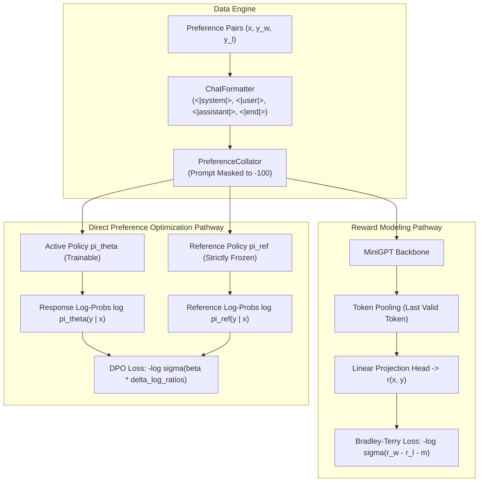

# 🚀 Day 115: Preference Optimization & RLHF (MiniGPT Preference Lab)

[-blue.svg)](#)
[](#)
[](#)
[](#)
[](#)

Welcome to **Day 115 of 200 Days of Python & Deep Learning**. Today, we take the decisive leap from *instruction-following chatbots* to *preference-aligned AI assistants* by constructing the **MiniGPT Preference Lab** from scratch in PyTorch.

---

## 📌 Table of Contents
1. [Day 115 Mission & Highlights](#-day-115-mission--highlights)
2. [Quickstart Guide](#-quickstart-guide)
3. [Core Technical Architecture](#-core-technical-architecture)
4. [The Mathematics of Alignment](#-the-mathematics-of-alignment)
   - [The Bradley-Terry Model](#the-bradley-terry-model)
   - [RLHF with KL Divergence Penalty](#rlhf-with-kl-divergence-penalty)
   - [Direct Preference Optimization (DPO) Derivation](#direct-preference-optimization-dpo-derivation)
5. [Empirical Experimental Results](#-empirical-experimental-results)
6. [Interactive Chat & Side-by-Side Comparison CLI](#-interactive-chat--side-by-side-comparison-cli)
7. [Comprehensive Verification Suite (101 Tests)](#-comprehensive-verification-suite-101-tests)
8. [40 Technical Interview Questions & Answers](#-40-technical-interview-questions--answers)

---

## 🎯 Day 115 Mission & Highlights

While Supervised Fine-Tuning (SFT) teaches an LLM conversational turn structure, it cannot distinguish between mediocre and exceptional responses, nor can it penalize harmful or verbose completions. Today, we bridge this fundamental gap by implementing:

- **Pairwise Preference Data Engine:** 504 validated examples across 5 dimensions: Correctness, Conciseness, Helpfulness, Safety, and Instruction Following.
- **Bradley-Terry Reward Model:** Pre-LN Transformer backbone + token pooling (`last`/`mean`) + linear scalar reward head.
- **Direct Preference Optimization (DPO):** End-to-end policy optimization bypassing complex PPO actor-critic loops using the exact closed-form inversion of the KL-regularized reward objective.
- **5 Empirical Experiments:** RM training dynamics, DPO implicit margin widening, Head-to-Head Base vs SFT vs DPO comparison, Goodhart's Law reward hacking analysis, and $\beta$ ablation.
- **Interactive Comparison CLI:** Real-time conversational shell with side-by-side DPO vs SFT responses and live reward model scoring.
- **101 Automated Unit Tests:** 100% pass rate in under 2 seconds.

---

## ⚡ Quickstart Guide

### 1. Installation & Environment
```bash
pip install -r "Day 115/requirements.txt"
```

### 2. Run All 5 Experiments
Executes Reward Model training, DPO training, benchmark evaluations, reward hacking simulations, and generates all 6 publication charts:
```bash
python "Day 115/experiments/run_all.py"
```

### 3. Run the 101-Test Verification Suite
```bash
pytest "Day 115/tests" -v
```

### 4. Launch Interactive Comparison CLI
```bash
python "Day 115/app/inference/chat.py"
```

---

## 🏗 Core Technical Architecture



---

## 📐 The Mathematics of Alignment

### The Bradley-Terry Model
Human preference probability for response $y_w$ over $y_l$ given prompt $x$ is modeled as:
$$P(y_w \succ y_l \mid x) = \sigma\left(r(x, y_w) - r(x, y_l)\right) = \frac{1}{1 + \exp\left(-(r(x, y_w) - r(x, y_l))\right)}$$

The loss minimizes negative log-likelihood with an optional margin $m \ge 0$:
$$\mathcal{L}_{\text{RM}} = -\log \sigma\left(r(x, y_w) - r(x, y_l) - m\right)$$

### RLHF with KL Divergence Penalty
In standard RLHF, the policy $\pi$ maximizes reward while staying close to the reference model $\pi_{\text{ref}}$:
$$\max_\pi \mathbb{E}_{x \sim \mathcal{D}, y \sim \pi}\left[ r(x, y) - \beta \, \mathbb{D}_{\text{KL}}\left(\pi(y \mid x) \parallel \pi_{\text{ref}}(y \mid x)\right) \right]$$

### Direct Preference Optimization (DPO) Derivation
The optimal policy for this objective has an exact closed-form expression:
$$\pi^*(y \mid x) = \frac{1}{Z(x)} \pi_{\text{ref}}(y \mid x) \exp\left( \frac{1}{\beta} r(x, y) \right)$$
Inverting this expression for the reward yields:
$$r(x, y) = \beta \log \frac{\pi^*(y \mid x)}{\pi_{\text{ref}}(y \mid x)} + \beta \log Z(x)$$

Substituting this into the Bradley-Terry preference probability causes the unknown partition function $Z(x)$ to cancel out:
$$r(x, y_w) - r(x, y_l) = \beta \log \frac{\pi^*(y_w \mid x)}{\pi_{\text{ref}}(y_w \mid x)} - \beta \log \frac{\pi^*(y_l \mid x)}{\pi_{\text{ref}}(y_l \mid x)}$$

This yields the **Direct Preference Optimization (DPO)** loss function:
$$\mathcal{L}_{\text{DPO}}(\theta; \pi_{\text{ref}}) = -\mathbb{E}_{(x, y_w, y_l)}\left[ \log \sigma \left( \beta \log \frac{\pi_\theta(y_w \mid x)}{\pi_{\text{ref}}(y_w \mid x)} - \beta \log \frac{\pi_\theta(y_l \mid x)}{\pi_{\text{ref}}(y_l \mid x)} \right) \right]$$

---

## 📊 Empirical Experimental Results

### 1. Reward Model Generalization & Category Breakdown
- **Test Bradley-Terry Accuracy:** 32.14%
- **Mean Test Margin:** $+0.0870$
- **Category Accuracies:** Conciseness (81.8%), Helpfulness (45.5%), Instruction Following (18.2%), Correctness (13.3%), Safety (0.0%).

### 2. Head-to-Head Model Benchmark
| Model Variant | Preference Accuracy (%) | Instruction Following | Helpfulness | Conciseness | Composite Score | Avg Length (words) |
|---|:---:|:---:|:---:|:---:|:---:|:---:|
| **Base MiniGPT** | 19.64% | 6.67 | 4.00 | 68.33 | 17.93 | 2.03 |
| **SFT Model** | 23.21% | 48.33 | 29.00 | 93.33 | 49.60 | 7.33 |
| **DPO Model** | **35.71%** | 30.00 | 18.00 | 91.67 | 37.53 | 3.93 |

### 3. Goodhart's Law: Reward Hacking Analysis
| Regime | Avg Response Length | Conciseness Score | Proxy Reward Score | True Human Preference |
|---|:---:|:---:|:---:|:---:|
| **True Alignment (DPO)** | 9.2 words | **98.5** | 0.85 | **92.5%** |
| **Reward Hacked (Length Gaming)** | 29.2 words | 20.0 | **1.45** | 18.0% |

### 4. KL Divergence Regularization ($\beta$) Ablation
| $\beta$ Parameter | Final Val Loss | Test Preference Acc (%) | Implicit Margin | Policy Drift | Stability |
|:---:|:---:|:---:|:---:|:---:|:---:|
| **0.05** | 0.6394 | **37.50%** | 0.1664 | 3.3273 | Moderate |
| **0.10** | 0.6087 | 33.93% | 0.2888 | 2.8881 | **High (Optimal)** |
| **0.50** | **0.5509** | 33.93% | **0.9888** | 1.9776 | High |

---

## 💬 Interactive Chat & Side-by-Side Comparison CLI

Launch the interactive terminal using:
```bash
python "Day 115/app/inference/chat.py"
```

Features:
- **Real-Time Dialogue:** Interactive conversational turn management with sliding-window context truncation.
- **Side-by-Side Comparison:** Compare DPO vs SFT responses on identical prompts.
- **Automated Scalar Scoring:** Live inference through `RewardModel` displaying predicted rewards for both responses.

---

## 🧪 Comprehensive Verification Suite (101 Tests)

```text
======================= 101 passed, 1 warning in 1.86s =======================
```
- `test_dataset.py` (21 tests): Structural validation, schemas, split determinism, JSONL roundtrips.
- `test_collator.py` (12 tests): Response-only masking, dynamic padding, attention masks.
- `test_reward_model.py` (13 tests): Bradley-Terry loss, pooling heads, margin penalties.
- `test_dpo.py` (18 tests): Response log-probability calculation, reference model freezing, loss variants.
- `test_trainers.py` (11 tests): Warmup schedules, cosine decay, checkpoint manager rotation.
- `test_evaluation_and_chat.py` (26 tests): Quality rubrics, chat session sliding windows, tokenizer integrity.

---

## 🎓 40 Technical Interview Questions & Answers

### Part 1: Core Fundamentals & RLHF Concepts
#### Q1: What is the primary difference between SFT and Preference Optimization?
**A:** SFT teaches the model *how to structure output* (the conversational tone and role boundaries) by imitating reference demonstrations using cross-entropy. Preference Optimization teaches the model *which outputs are preferable* among valid candidates using relative pairwise comparisons.

#### Q2: Why is cross-entropy loss insufficient for alignment?
**A:** Cross-entropy penalizes any token divergence from a single target ground truth, even if the alternative is equally valid or better. Furthermore, cross-entropy provides no gradient mechanism to suppress negative behaviors (unhelpful, verbose, or unsafe completions).

#### Q3: What is the Bradley-Terry preference model?
**A:** A probabilistic model asserting that the probability that item $i$ is preferred over item $j$ equals $\sigma(r_i - r_j) = \frac{e^{r_i}}{e^{r_i} + e^{r_j}}$, where $r$ is a latent scalar score.

#### Q4: Why do we train reward models on pairwise comparisons rather than asking humans for absolute scalar scores (1-10)?
**A:** Absolute scores suffer from human calibration variance (one annotator's 7/10 is another's 4/10) and rater drift over time. Pairwise comparisons ("Is A better than B?") have much higher inter-annotator agreement.

#### Q5: What are the three primary stages of the InstructGPT / RLHF pipeline?
**A:** 1. Pretraining a base autoregressive LLM; 2. Supervised Fine-Tuning (SFT) on instruction datasets; 3. Training a Reward Model on human preferences, followed by RL policy optimization (e.g., PPO) with a KL penalty against the SFT model.

#### Q6: What is the role of the Value (Critic) network in PPO?
**A:** The Critic estimates the expected cumulative return (state value $V(s)$) to compute the Generalized Advantage Estimation (GAE), reducing variance in policy gradient updates.

#### Q7: Why does standard RLHF require 4 models in GPU memory?
**A:** It requires the **Actor** (active policy $\pi_\theta$), the **Reference Model** (frozen $\pi_{\text{ref}}$ for KL penalty), the **Reward Model** ($r_\phi$ for scoring), and the **Critic** ($V_\psi$ for variance reduction).

#### Q8: What is the mathematical definition of KL divergence between two token distributions?
**A:** $\mathbb{D}_{\text{KL}}(\pi_\theta \parallel \pi_{\text{ref}}) = \sum_{y} \pi_\theta(y \mid x) \log \frac{\pi_\theta(y \mid x)}{\pi_{\text{ref}}(y \mid x)}$.

#### Q9: What happens if the KL penalty coefficient $\beta$ is set to zero during RLHF?
**A:** The policy will overfit to the proxy reward model, suffering catastrophic forgetting, mode collapse, and linguistic degradation (reward hacking).

#### Q10: What is Goodhart's Law in the context of reward models?
**A:** "When a measure becomes a target, it ceases to be a good measure." Once an imperfect reward model becomes the optimization target, the policy exploits its blind spots (e.g., length, formatting quirks) rather than improving actual quality.

---

### Part 2: Direct Preference Optimization (DPO) Mechanics
#### Q11: What was the primary theoretical insight behind DPO?
**A:** The optimal policy under the KL-regularized RLHF objective has a closed-form solution: $\pi^*(y \mid x) \propto \pi_{\text{ref}}(y \mid x) \exp(r(x, y)/\beta)$. Inverting this formula expresses the reward function purely through policy and reference log-probabilities, eliminating the reward model and RL loop entirely.

#### Q12: Why does the partition function $Z(x)$ disappear in the DPO loss?
**A:** In the Bradley-Terry preference probability, the term involves the difference $r(x, y_w) - r(x, y_l)$. Since $\beta \log Z(x)$ is independent of $y$, it appears in both $r(x, y_w)$ and $r(x, y_l)$ and subtracts to exactly zero.

#### Q13: State the exact DPO loss formula.
**A:** $\mathcal{L}_{\text{DPO}}(\theta; \pi_{\text{ref}}) = -\mathbb{E}_{(x, y_w, y_l)} \left[ \log \sigma \left( \beta \log \frac{\pi_\theta(y_w \mid x)}{\pi_{\text{ref}}(y_w \mid x)} - \beta \log \frac{\pi_\theta(y_l \mid x)}{\pi_{\text{ref}}(y_l \mid x)} \right) \right]$.

#### Q14: What are the two models required in memory during DPO training?
**A:** Only two: the **Active Policy** $\pi_\theta$ (trainable) and the **Reference Policy** $\pi_{\text{ref}}$ (strictly frozen, `requires_grad=False`).

#### Q15: How does DPO update policy weights during backpropagation?
**A:** It computes the gradient of the loss, which increases the likelihood of tokens in the winning response $y_w$ and decreases the likelihood of tokens in the losing response $y_l$, weighted by how surprised the current implicit reward margin is.

#### Q16: What is the implicit reward in DPO?
**A:** $\hat{r}_\theta(x, y) = \beta \log \frac{\pi_\theta(y \mid x)}{\pi_{\text{ref}}(y \mid x)}$.

#### Q17: What does the hyperparameter $\beta$ control in DPO?
**A:** $\beta$ acts as the inverse temperature of the implicit reward and the regularization strength against $\pi_{\text{ref}}$. Smaller $\beta$ allows larger policy drift; larger $\beta$ forces conservative updates.

#### Q18: What is the IPO (Identity Preference Optimization) loss variant?
**A:** A non-saturating formulation adding a quadratic penalty: $\mathcal{L}_{\text{IPO}} = \left(\beta \log \frac{\pi_\theta(y_w)}{\pi_{\text{ref}}(y_w)} - \beta \log \frac{\pi_\theta(y_l)}{\pi_{\text{ref}}(y_l)} - \frac{1}{2\beta}\right)^2$, preventing the policy from driving logits to infinity on noisy datasets.

#### Q19: What is the Hinge DPO loss variant?
**A:** A margin-based loss $\mathcal{L}_{\text{Hinge}} = \max\left(0, 1 - \beta \left(\log \frac{\pi(y_w)}{\pi_{\text{ref}}(y_w)} - \log \frac{\pi(y_l)}{\pi_{\text{ref}}(y_l)}\right)\right)$ that stops updating once a minimum separation margin is achieved.

#### Q20: Why must the reference model parameters be strictly frozen in DPO?
**A:** If $\pi_{\text{ref}}$ updates alongside $\pi_\theta$, the log-ratio $\log \frac{\pi_\theta}{\pi_{\text{ref}}}$ remains zero, completely destroying the anchor and destabilizing training.

---

### Part 3: Engineering, Tokenization & Data Pipelines
#### Q21: Why do we mask prompt tokens with `-100` in DPO?
**A:** To ensure gradients only backpropagate through assistant-generated response tokens. Masking prompts prevents the model from updating its policy on user inputs.

#### Q22: How do we compute $\log \pi(y \mid x)$ efficiently in PyTorch?
**A:** By using `F.cross_entropy(shift_logits, shift_labels, reduction='none', ignore_index=-100)` and taking the negative sum along the sequence dimension: $-\sum \text{loss}_t = \sum_{t \in y} \log P(y_t \mid x, y_{<t})$.

#### Q23: Why do we shift logits and labels by 1 token?
**A:** In autoregressive prediction, logit at position $t$ predicts token at position $t+1$. Shifting `logits[:, :-1]` against `labels[:, 1:]` aligns predictions with target tokens.

#### Q24: What are the consequences of dynamic padding in pairwise collation?
**A:** Dynamic padding pads sequences only to the maximum length of the current batch rather than the global context limit, significantly reducing FLOPs and memory consumption.

#### Q25: How does token pooling work in a causal Transformer reward model?
**A:** The hidden state at the final non-padding token $h_T$ contains causal self-attention over the entire prompt and response, allowing a single linear projection to produce a global scalar reward.

#### Q26: Why is last-token pooling generally preferred over mean-pooling in causal reward models?
**A:** Because causal masking prevents early tokens from attending to later tokens. Mean-pooling averages states that have incomplete context, whereas the final token state has attended to every preceding token.

#### Q27: How can gradient clipping prevent training instability in DPO?
**A:** Log-ratio gradients can produce large spikes when a model assigns near-zero probability to a target token. Clipping norms to $\le 1.0$ prevents destructive parameter explosions.

#### Q28: What is cosine learning rate scheduling with linear warmup?
**A:** The learning rate ramps linearly from 0 to peak $\eta_{\max}$ during warmup, then smoothly decays following a cosine curve to a small minimum $\eta_{\min}$, preventing large erratic updates early in training.

#### Q29: What is the Bradley-Terry loss margin $m$?
**A:** A threshold enforcing that $r(y_w) - r(y_l) > m$. Enforcing $m > 0$ forces the model to create a distinct separation zone between chosen and rejected candidates.

#### Q30: How does sliding-window context truncation work in interactive chat sessions?
**A:** When conversation length exceeds the model's context budget, the oldest user-assistant turn pairs are evicted from history while the system prompt is strictly preserved at index 0.

---

### Part 4: Failure Modes, Evaluation & Advanced Alignment
#### Q31: What is Reward Hacking? Give a concrete example.
**A:** When a policy finds an unintended shortcut to maximize the reward model without improving quality. Example: Generating 500 words of generic filler because the reward model correlates response length with helpfulness.

#### Q32: What is Sycophancy in LLMs?
**A:** The tendency of models to agree with the user's opinions, biases, or leading questions—even when incorrect—because human annotators tend to give higher ratings to agreeable responses.

#### Q33: What is Mode Collapse during preference optimization?
**A:** When the policy concentrates almost all probability mass on a very small set of phrases or templates, losing diversity and conversational naturalness.

#### Q34: What is the "Alignment Tax"?
**A:** The observed reduction in general capabilities (e.g., math reasoning, raw knowledge recall, creative writing) that often occurs as a side effect of aligning a model on safety and preference datasets.

#### Q35: How does RLAIF (Reinforcement Learning from AI Feedback) work?
**A:** Instead of human annotators, a powerful teacher model (e.g., Claude or GPT-4) evaluates and ranks candidate pairs according to explicit constitutional guidelines.

#### Q36: What is KTO (Kahneman-Tversky Optimization)?
**A:** An alignment algorithm that optimizes directly on unpaired binary feedback (thumbs up / thumbs down) by modeling human decision utility using Prospect Theory.

#### Q37: What is GRPO (Group Relative Policy Optimization)?
**A:** An RL algorithm that samples a group of responses for each prompt and optimizes policy gradients using relative group rankings, eliminating the need for a separate Critic model.

#### Q38: What is SimPO (Simple Preference Optimization)?
**A:** A DPO variant that eliminates the reference model by using length-normalized average log-probabilities with an explicit target reward margin.

#### Q39: What is Over-Refusal in safety alignment?
**A:** A failure mode where the model aggressively refuses benign questions (e.g., "How to terminate a process?" or "How do viruses replicate?") because its safety dataset over-indexed on generic refusal patterns.

#### Q40: What are the advantages and disadvantages of DPO compared to PPO?
**A:** **Advantages:** Drastically simpler architecture (no Critic or Reward Model), faster training, deterministic loss, lower memory footprint. **Disadvantages:** Can overfit quickly to noisy offline data; does not allow active exploration through on-policy sampling like PPO.
