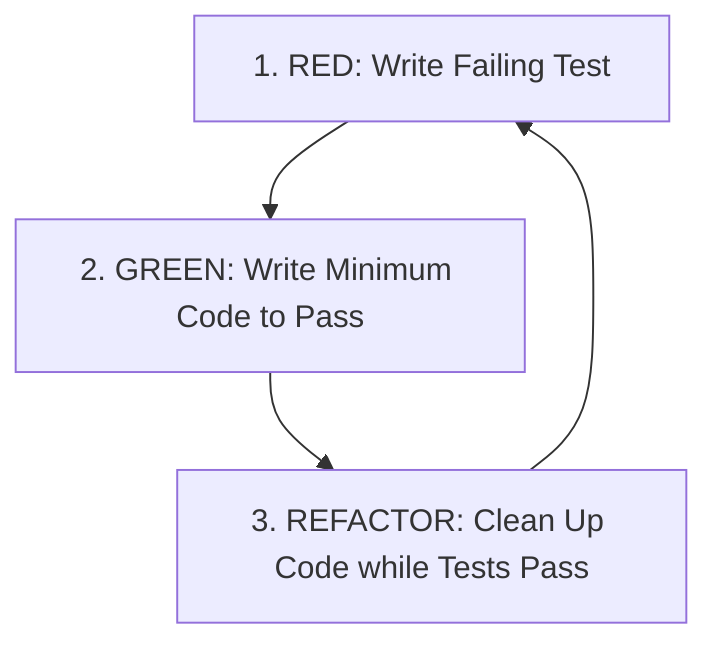

# 🐍 Day 20/200 – Masterclass Notes: Testing in Python (`unittest`)

🎯 **Goal:** Master automated unit testing in Python using the built-in `unittest` framework, assertion methods, test fixtures (`setUp`/`tearDown`), exception testing, test discovery, and Test-Driven Development (TDD) principles.

---

## 📌 Executive Summary & Key Takeaways

- **Unit Testing:** The practice of testing individual functions, methods, or modules in isolation to ensure code correctness and prevent regressions.
- **The `unittest` Module:** Python's built-in xUnit-style testing framework based on standard test cases (`unittest.TestCase`).
- **Test Discovery:** `unittest` automatically discovers test methods prefixed with `test_` inside files starting with `test_*.py`.
- **Test Fixtures:**
  - `setUp()`: Executes before **every** test method to initialize fresh state.
  - `tearDown()`: Executes after **every** test method to clean up resources (files, database connections).
- **Test-Driven Development (TDD):** Red $\rightarrow$ Green $\rightarrow$ Refactor development cycle.

---

## 📖 Topic 1: Writing `unittest.TestCase` Classes

### 1.1 Anatomy of a Test Case

```python
import unittest

def multiply(a, b):
    return a * b

class TestMathOperations(unittest.TestCase):

    def test_multiply_positive(self):
        # Assertion checking expected vs actual result
        self.assertEqual(multiply(4, 5), 20)

    def test_multiply_zero(self):
        self.assertEqual(multiply(10, 0), 0)

if __name__ == "__main__":
    unittest.main()
```

---

## 📖 Topic 2: Standard Assertion Methods Table

| Assertion Method | Checks | Example Usage |
|---|---|---|
| `self.assertEqual(a, b)` | $a == b$ | `self.assertEqual(add(2, 3), 5)` |
| `self.assertNotEqual(a, b)` | $a \ne b$ | `self.assertNotEqual(val, 0)` |
| `self.assertTrue(x)` | `bool(x) is True` | `self.assertTrue(is_even(4))` |
| `self.assertFalse(x)` | `bool(x) is False` | `self.assertFalse(is_even(5))` |
| `self.assertIs(a, b)` | $a \text{ is } b$ (Same object identity) | `self.assertIs(obj1, obj2)` |
| `self.assertIsNone(x)` | $x \text{ is None}$ | `self.assertIsNone(result)` |
| `self.assertIn(member, container)` | `member in container` | `self.assertIn("Python", skills)` |
| `self.assertRaises(exception)` | Function raises specified error | `with self.assertRaises(ZeroDivisionError):` |

---

## 📖 Topic 3: Test Fixtures (`setUp` & `tearDown`)

```python
import unittest, os

class TestFileOperations(unittest.TestCase):

    def setUp(self):
        """Runs BEFORE every test method."""
        self.filename = "test_temp.txt"
        with open(self.filename, "w", encoding="utf-8") as f:
            f.write("Test Data Payload")

    def tearDown(self):
        """Runs AFTER every test method."""
        if os.path.exists(self.filename):
            os.remove(self.filename)

    def test_file_reading(self):
        with open(self.filename, "r", encoding="utf-8") as f:
            content = f.read()
        self.assertEqual(content, "Test Data Payload")
```

---

## 📖 Topic 4: Test-Driven Development (TDD) Workflow



---

## ⚡ Master Cheat Sheet

```python
# unittest Master Cheat Sheet

import unittest

class MasterTestSuite(unittest.TestCase):
    
    # 1. Testing Exception Raising
    def test_zero_division(self):
        with self.assertRaises(ZeroDivisionError):
            val = 10 / 0

    # 2. Testing Almost Equal (Floating-point precision)
    def test_float_precision(self):
        self.assertAlmostEqual(0.1 + 0.2, 0.3, places=7)

    # 3. Testing Container Membership
    def test_container(self):
        self.assertIn("Python", ["C++", "Java", "Python"])
```

---

## ⚠️ Common Pitfalls & Best Practices

1. **Forgetting the `test_` Prefix:**
   - ❌ `def check_addition(self):` (`unittest` ignores methods not starting with `test_`).
   - ✅ `def test_addition(self):` (Correct prefix).

2. **Inter-test Dependency State Mutation:**
   - Tests should be completely independent. Never rely on Test A running before Test B. Use `setUp()` to reset shared fixtures.

---

## ❓ Practice & Interview Questions (With Solutions)

### Q1: What is the difference between `setUp()` and `setUpClass()`?
**Answer:** `setUp()` runs before *every single test method* in the TestCase class. `setUpClass()` runs *once for the entire class* before any test methods execute (requires `@classmethod` decorator).

### Q2: How do you run automated test discovery across an entire project directory?
**Answer:** Run `python -m unittest discover -s . -p "test_*.py"` from the root directory.

---

## 📝 Recap Checklist
- [x] Defined test cases inheriting from `unittest.TestCase`.
- [x] Asserted expected outputs using `assertEqual`, `assertTrue`, `assertIn`, and `assertAlmostEqual`.
- [x] Tested exception throwing using `assertRaises()` context manager.
- [x] Used `setUp()` and `tearDown()` fixtures to manage test state lifecycle.
- [x] Executed automated unit tests for Calculator, Student Grade System, and Bank Account modules.
