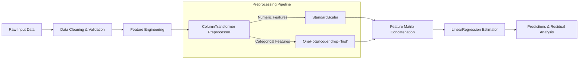

# 🚀 DAY 74 / 200 — Multiple Linear Regression

**Progress:** 74 / 200 → **37.0% complete**  
**Remaining:** **126 days 🔥**

---

## 🎯 1. Today's Mission & Learning Objectives

Yesterday you built your first supervised machine learning model using **Simple Linear Regression**, modeling how a single explanatory predictor influences an outcome.

Today you make the decisive transition from bivariate modeling to multivariate statistical learning:

> **“Can advertising spend across TV, Digital, and Radio, along with promotional discounts, store quantity, geographical region, and seasonal factors together predict sales?”**

Multiple Linear Regression (MLR) forms the analytical cornerstone of econometrics, quantitative finance, clinical epidemiology, and modern statistical learning. By the end of Day 74, you will master:

1. **Multiple Linear Regression Foundations:** Generalizing simple bivariate regression to $p$-dimensional feature spaces.
2. **Mathematical Formulation & Normal Equations:** Closed-form OLS parameter estimation via vector calculus and matrix algebra: $\mathbf{b} = (\mathbf{X}^T \mathbf{X})^{-1} \mathbf{X}^T \mathbf{y}$.
3. **Coefficient Interpretation & Partial Effects:** The principle of *ceteris paribus* (“holding all other variables constant”) and geometric hyperplane projections.
4. **The Intercept Parameter:** Analytical meaning and domain validation when $\mathbf{x} = \mathbf{0}$.
5. **Coefficient of Determination ($R^2$) vs. Adjusted $R^2$:** Why ordinary $R^2$ monotonically increases with added features and how Adjusted $R^2$ penalizes degrees-of-freedom loss.
6. **Categorical Predictors & One-Hot Encoding:** Representing nominal factors and avoiding the **Dummy Variable Trap** (perfect multicollinearity) via reference category omission (`drop='first'`).
7. **Feature Scaling & Standardization:** Why OLS predictions are invariant to scale, yet scaling is critical for coefficient comparability, numerical stability, and regularized extensions.
8. **Multicollinearity & Variance Inflation Factor (VIF):** Detecting collinear relationships among predictors and diagnosing inflated standard errors: $\text{VIF}_j = 1 / (1 - R_j^2)$.
9. **Gauss-Markov Assumptions & Residual Diagnostics:** Verifying exogeneity, homoscedasticity, residual normality, and independence of errors.
10. **Model Evaluation Metrics:** Rigorous formulation and practical interpretation of $\text{MAE}$, $\text{MSE}$, and $\text{RMSE}$.
11. **Production Pipelines:** Building leakage-free preprocessing and modeling pipelines using Scikit-learn's `ColumnTransformer` and `Pipeline`.

---

## 🧠 2. Simple Linear vs. Multiple Linear Regression

In Simple Linear Regression (Day 73), you mapped a single scalar feature $x$ to target $y$:

$$\hat{y} = \beta_0 + \beta_1 x$$

Visually, this fits a 2D line through a scatter of points $(x_i, y_i)$.

In **Multiple Linear Regression**, the response variable $y$ is modeled as a linear combination of $p$ distinct explanatory predictors $x_1, x_2, \dots, x_p$:

$$\hat{y} = \beta_0 + \beta_1 x_1 + \beta_2 x_2 + \beta_3 x_3 + \dots + \beta_p x_p$$

```text
Simple Linear Regression (2D):          Multiple Linear Regression (p-D Hyperplane):
      y ^                                     y ^
        |        /                                |      /|\
        |       /  (Line)                         |     / | \   (Hyperplane)
        |      /                                  |    /__|__\
        +------------> x                          +------------> x1
                                                   \
                                                    \-> x2
```

For $p = 2$ predictors, the model defines a **2D regression plane** in 3D Euclidean space. For $p \ge 3$, the model defines a **$p$-dimensional regression hyperplane** embedded in $\mathbb{R}^{p+1}$.

---

## 📐 3. Matrix Derivation of Ordinary Least Squares (OLS)

Let $n$ denote the number of observations and $p$ denote the number of independent features. The system of $n$ linear equations is:

$$y_i = \beta_0 + \beta_1 x_{i1} + \beta_2 x_{i2} + \dots + \beta_p x_{ip} + \epsilon_i, \quad i = 1, 2, \dots, n$$

In compact matrix notation:

$$\mathbf{y} = \mathbf{X} \boldsymbol{\beta} + \boldsymbol{\epsilon}$$

Where:
* $\mathbf{y} \in \mathbb{R}^{n \times 1}$ is the observed target column vector.
* $\mathbf{X} \in \mathbb{R}^{n \times (p+1)}$ is the **design matrix**, prepended with a column of ones for the intercept:

$$\mathbf{X} = \begin{bmatrix} 1 & x_{11} & x_{12} & \dots & x_{1p} \\ 1 & x_{21} & x_{22} & \dots & x_{2p} \\ \vdots & \vdots & \vdots & \ddots & \vdots \\ 1 & x_{n1} & x_{n2} & \dots & x_{np} \end{bmatrix}$$

* $\boldsymbol{\beta} = [\beta_0, \beta_1, \dots, \beta_p]^T \in \mathbb{R}^{(p+1) \times 1}$ is the parameter vector.
* $\boldsymbol{\epsilon} \in \mathbb{R}^{n \times 1}$ is the unobserved disturbance vector.

### Minimizing the Sum of Squared Residuals ($SS_{\text{res}}$)

The residual vector is $\mathbf{e} = \mathbf{y} - \hat{\mathbf{y}} = \mathbf{y} - \mathbf{X} \mathbf{b}$. The objective function $S(\mathbf{b})$ to minimize is:

$$S(\mathbf{b}) = \mathbf{e}^T \mathbf{e} = (\mathbf{y} - \mathbf{X}\mathbf{b})^T (\mathbf{y} - \mathbf{X}\mathbf{b}) = \mathbf{y}^T \mathbf{y} - 2 \mathbf{b}^T \mathbf{X}^T \mathbf{y} + \mathbf{b}^T \mathbf{X}^T \mathbf{X} \mathbf{b}$$

Taking the partial derivative with respect to $\mathbf{b}$ and setting it to the zero vector:

$$\frac{\partial S}{\partial \mathbf{b}} = -2 \mathbf{X}^T \mathbf{y} + 2 \mathbf{X}^T \mathbf{X} \mathbf{b} = \mathbf{0}$$

This yields the fundamental **Normal Equations**:

$$\mathbf{X}^T \mathbf{X} \mathbf{b} = \mathbf{X}^T \mathbf{y}$$

Assuming $\mathbf{X}$ has full column rank ($p+1$), the matrix $\mathbf{X}^T \mathbf{X}$ is invertible, yielding the closed-form OLS estimator:

$$\mathbf{b} = (\mathbf{X}^T \mathbf{X})^{-1} \mathbf{X}^T \mathbf{y}$$

---

## 📚 4. Core Concepts Deep Dive

### Concept 1: Independent vs. Dependent Variables
* **Independent Variables (Features / Explanatory Predictors $X$):** The measured inputs hypothesized to explain variation in the target (e.g., `TV_Spend`, `Digital_Spend`, `Discount`).
* **Dependent Variable (Target / Response $y$):** The outcome being estimated or forecasted (e.g., `Sales`).

### Concept 2: Partial Regression Coefficients & *Ceteris Paribus*
Each slope coefficient $\beta_j$ represents the **partial derivative** of the conditional expectation function:

$$\beta_j = \frac{\partial \mathbb{E}[y \mid \mathbf{x}]}{\partial x_j}$$

> **Key Rule of Interpretation:** $\beta_j$ indicates the estimated change in the mean response $\mathbb{E}[y]$ per one-unit increase in $x_j$, **holding all other variables in the model fixed (*ceteris paribus*)**.

### Concept 3: The Intercept Parameter ($\beta_0$)
$$\beta_0 = \mathbb{E}[y \mid x_1 = 0, x_2 = 0, \dots, x_p = 0]$$
The intercept is mathematically necessary to anchor the hyperplane and enforce $\bar{e} = 0$. However, if zero values for all predictors lie outside the range of observed data (e.g., zero store traffic, zero advertising, zero quantity), $\beta_0$ serves as an extrapolation baseline rather than a realistic business projection.

### Concept 4: $R^2$ vs. Adjusted $R^2$
The standard Coefficient of Determination measures the proportion of total variance explained by the model:

$$R^2 = 1 - \frac{SS_{\text{res}}}{SS_{\text{tot}}} = 1 - \frac{\sum (y_i - \hat{y}_i)^2}{\sum (y_i - \bar{y})^2}$$

#### The Mathematical Problem with $R^2$
Adding any new feature $x_{p+1}$ to an OLS model **can never decrease $R^2$ on the training set**, even if the feature consists entirely of random Gaussian noise. Because OLS minimizes $SS_{\text{res}}$, adding a feature gives the optimization algorithm an additional degree of freedom, guaranteeing $SS_{\text{res}}^{\text{new}} \le SS_{\text{res}}^{\text{old}}$.

#### The Solution: Adjusted $R^2$
Adjusted $R^2$ incorporates an explicit degrees-of-freedom penalty for model complexity:

$$\text{Adjusted } R^2 = 1 - \left(1 - R^2\right) \frac{n - 1}{n - p - 1}$$

Where:
* $n$ = number of observations.
* $p$ = number of explanatory features (excluding intercept).

If a newly added variable explains less additional variance than expected by pure chance, the penalty factor $\frac{n-1}{n-p-1}$ outweighs the reduction in $(1 - R^2)$, causing Adjusted $R^2$ to **decrease**.

### Concept 5: Categorical Variables & The Dummy Variable Trap
Linear models require numeric inputs. Qualitative factors (e.g., Region $\in$ `{"North", "South", "East", "West"}`) must be converted into binary indicator (dummy) variables:

$$D_j = \begin{cases} 1 & \text{if observation belongs to category } j \\ 0 & \text{otherwise} \end{cases}$$

#### The Dummy Variable Trap
If a categorical feature has $K$ categories and we include all $K$ dummy columns alongside an intercept column $\mathbf{1}$, we create **perfect multicollinearity**:

$$\sum_{k=1}^K D_{ik} = 1 = x_{i0} \quad \forall i$$

This makes the design matrix $\mathbf{X}$ rank-deficient, $(\mathbf{X}^T \mathbf{X})$ singular, and its inverse undefined.

**Remedy:** Always drop one reference category:
```python
from sklearn.preprocessing import OneHotEncoder
encoder = OneHotEncoder(drop='first', sparse_output=False)
```
For $K = 4$ regions, we generate 3 indicators (`Region_South`, `Region_East`, `Region_West`). The omitted category (`Region_North`) becomes the **reference baseline**, absorbed into $\beta_0$.

### Concept 6: Feature Scaling
* **Standardization (Z-Score):** $z = \frac{x - \mu}{\sigma}$
* **Min-Max Normalization:** $x_{\text{scaled}} = \frac{x - x_{\min}}{x_{\max} - x_{\min}}$

> **Important Invariance Property:** In unpenalized OLS, scaling features does **not** change the fitted predictions $\hat{y}$, the residuals $e$, or $R^2$. The coefficients simply scale inversely: $\beta_j^{\text{scaled}} = \beta_j \cdot \sigma_{x_j}$.
> 
> However, standardization is indispensable when:
> 1. Comparing relative coefficient magnitudes (standardized effect sizes).
> 2. Improving numerical condition numbers of $(\mathbf{X}^T \mathbf{X})$.
> 3. Transitioning to regularized linear regression (Ridge, Lasso, Elastic Net).

### Concept 7: Multicollinearity & Variance Inflation Factor (VIF)
Multicollinearity occurs when two or more independent variables are strongly correlated.

#### Consequences:
1. **Inflated Parameter Variance:** Standard errors $SE(\beta_j)$ blow up, leading to wide confidence intervals and high p-values even when the overall model $F$-test is highly significant.
2. **Coefficient Instability:** Minor fluctuations in sample data cause drastic changes in coefficient signs and magnitudes.
3. **Impaired Interpretability:** It becomes impossible to isolate the individual partial effect of $x_j$.

#### Diagnosing Multicollinearity via VIF
The Variance Inflation Factor for predictor $j$ is defined as:

$$\text{VIF}_j = \frac{1}{1 - R_j^2}$$

Where $R_j^2$ is the coefficient of determination obtained from regressing feature $x_j$ against all other $p-1$ predictors.

| VIF Range | Degree of Collinearity | Practical Action |
|:---|:---|:---|
| $\text{VIF} = 1.0$ | Completely Orthogonal | Ideal. No collinearity present. |
| $1.0 < \text{VIF} < 5.0$ | Low to Moderate | Acceptable for most modeling tasks. |
| $5.0 \le \text{VIF} < 10.0$ | High Collinearity | Investigate feature overlap; monitor variance. |
| $\text{VIF} \ge 10.0$ | Severe Multicollinearity | Remediate immediately via feature pruning or PCA. |

---

## 📈 5. Evaluation Metrics & Residual Diagnostics

### Comprehensive Metrics

| Metric | Mathematical Formula | Units | Sensitive To |
|:---|:---|:---|:---|
| **MAE** | $\frac{1}{n} \sum_{i=1}^n \lvert y_i - \hat{y}_i \rvert$ | Same as $y$ | Robust to extreme outliers |
| **MSE** | $\frac{1}{n} \sum_{i=1}^n (y_i - \hat{y}_i)^2$ | $(y)^2$ | Heavily penalizes large deviations |
| **RMSE** | $\sqrt{\frac{1}{n} \sum_{i=1}^n (y_i - \hat{y}_i)^2}$ | Same as $y$ | Balanced, intuitive standard error |
| **$R^2$** | $1 - \frac{\sum (y_i - \hat{y}_i)^2}{\sum (y_i - \bar{y})^2}$ | Dimensionless $[-\infty, 1]$ | Compares model to constant mean |
| **Adj. $R^2$** | $1 - (1 - R^2)\frac{n-1}{n-p-1}$ | Dimensionless $[-\infty, 1]$ | Penalizes unnecessary predictors |

### Gauss-Markov Assumptions for Best Linear Unbiased Estimator (BLUE)
Under the **Gauss-Markov Theorem**, the OLS estimator is BLUE if the following conditions hold:
1. **Linearity in Parameters:** $\mathbf{y} = \mathbf{X}\boldsymbol{\beta} + \boldsymbol{\epsilon}$.
2. **Strict Exogeneity:** $\mathbb{E}[\boldsymbol{\epsilon} \mid \mathbf{X}] = \mathbf{0}$.
3. **No Multicollinearity:** $\text{rank}(\mathbf{X}) = p + 1$ (no exact linear dependence).
4. **Spherical Errors (Homoscedasticity & No Autocorrelation):**
   $$\text{Var}(\boldsymbol{\epsilon} \mid \mathbf{X}) = \sigma^2 \mathbf{I}_n$$
   * Homoscedasticity: $\text{Var}(\epsilon_i \mid \mathbf{X}) = \sigma^2$ (constant variance).
   * Independence: $\text{Cov}(\epsilon_i, \epsilon_j \mid \mathbf{X}) = 0$ for all $i \neq j$.

---

## 🛠️ 6. Professional Scikit-learn Pipeline Architecture



---

## 🧠 7. 30 Comprehensive Interview Questions & Expert Answers

### Section A: Beginner Fundamentals (Q1–Q10)

#### Q1: What is Multiple Linear Regression?
**Answer:** Multiple Linear Regression is a supervised learning algorithm that models the linear relationship between a continuous scalar dependent target variable ($y$) and two or more continuous or categorical independent explanatory features ($x_1, x_2, \dots, x_p$) plus an additive error term.

#### Q2: What is the primary difference between Simple and Multiple Linear Regression?
**Answer:** Simple Linear Regression evaluates a single predictor ($p=1$) fitting a 2D line, whereas Multiple Linear Regression evaluates $p \ge 2$ predictors simultaneously fitting a $p$-dimensional hyperplane, allowing the analyst to estimate the partial effect of each variable while controlling for all others.

#### Q3: What is an independent variable?
**Answer:** An independent variable (also termed predictor, feature, covariate, or explanatory variable) is an observed quantity fed into the model as an input to account for variability in the target outcome.

#### Q4: What is a dependent variable?
**Answer:** A dependent variable (also termed target, response, outcome, or regressand) is the continuous variable the model aims to predict or explain.

#### Q5: What does a regression coefficient represent?
**Answer:** A regression coefficient $\beta_j$ represents the expected change in the dependent variable $y$ for a one-unit change in predictor $x_j$, holding all other predictors in the model constant (*ceteris paribus*).

#### Q6: What does the intercept represent?
**Answer:** The intercept $\beta_0$ represents the expected value of $y$ when all independent variables in the model equal zero.

#### Q7: What does a positive coefficient signify?
**Answer:** A positive coefficient indicates that, holding other factors constant, higher values of that predictor are associated with higher predicted values of the target variable.

#### Q8: What does a negative coefficient signify?
**Answer:** A negative coefficient indicates an inverse relationship: holding other factors constant, an increase in that predictor is associated with a decrease in the predicted target value.

#### Q9: What is the difference between an error and a residual?
**Answer:** An **error** ($\epsilon_i$) is the theoretical deviation of an observation from the true, unobservable population regression line. A **residual** ($e_i = y_i - \hat{y}_i$) is the sample-based deviation of an observed point from the fitted empirical regression hyperplane.

#### Q10: Why must we split data into training and testing sets?
**Answer:** Training and testing splits ensure an unbiased evaluation of the model's ability to generalize to new, unseen data, preventing optimistic performance estimates driven by in-sample memorization or overfitting.

---

### Section B: Intermediate Diagnostics & Preprocessing (Q11–Q20)

#### Q11: What does "holding other variables constant" mean mathematically?
**Answer:** Mathematically, it corresponds to the partial derivative of the expectation function: $\frac{\partial \mathbb{E}[y \mid \mathbf{x}]}{\partial x_j} = \beta_j$. Geometrically, it slices the multi-dimensional response surface along the dimension of $x_j$ at fixed coordinates for all other features.

#### Q12: Why is $R^2$ not equivalent to model accuracy?
**Answer:** $R^2$ is the proportion of target variance explained relative to a horizontal line through the mean $\bar{y}$. It does not measure absolute error (unlike MAE/RMSE), can be high even when residuals violate all assumptions, and is inapplicable to non-linear classification tasks.

#### Q13: What is Adjusted $R^2$, and why is it necessary?
**Answer:** Adjusted $R^2$ is a modified $R^2$ that penalizes the inclusion of redundant predictors by accounting for sample size ($n$) and parameter count ($p$): $\text{Adjusted } R^2 = 1 - (1 - R^2) \frac{n-1}{n-p-1}$. It prevents artificial inflation of fit metrics from uninformative features.

#### Q14: What is multicollinearity?
**Answer:** Multicollinearity is a condition in multiple regression where two or more explanatory variables are linearly correlated with each other, meaning one predictor can be accurately predicted from the others.

#### Q15: Why is multicollinearity problematic in OLS?
**Answer:** While it does not bias predictions or impair overall $R^2$, multicollinearity makes the design matrix $(\mathbf{X}^T \mathbf{X})$ near-singular. This causes the variances and standard errors of coefficients to explode, making individual coefficient estimates volatile and untrustworthy.

#### Q16: What is the Variance Inflation Factor (VIF)?
**Answer:** VIF measures how much the variance of an estimated regression coefficient is inflated due to collinearity with other features: $\text{VIF}_j = \frac{1}{1 - R_j^2}$, where $R_j^2$ is the coefficient of determination from regressing $x_j$ on all other predictors.

#### Q17: What is One-Hot Encoding?
**Answer:** One-Hot Encoding is the process of converting a categorical variable with $K$ distinct levels into a set of $K$ binary indicator variables, each taking the value 1 if the observation belongs to that level and 0 otherwise.

#### Q18: What is the Dummy Variable Trap?
**Answer:** The Dummy Variable Trap occurs when all $K$ indicator variables of a categorical feature are included in a regression model alongside a constant intercept term. Because the sum of the $K$ indicators equals 1, perfect collinearity ensues, making $(\mathbf{X}^T \mathbf{X})$ singular and non-invertible.

#### Q19: How is the Dummy Variable Trap prevented?
**Answer:** By dropping one reference category (e.g., setting `drop='first'`), which leaves $K-1$ indicator variables. The omitted category is absorbed into the intercept $\beta_0$ and serves as the baseline comparison group.

#### Q20: Does feature scaling affect OLS predictions?
**Answer:** No. In standard Ordinary Least Squares without regularization, linear scaling (standardization or min-max normalization) is an affine transformation that is exactly canceled out by the parameter optimization. Predictions $\hat{y}$, residuals $e$, and $R^2$ remain identical.

---

### Section C: Advanced Theory & Practical Nuance (Q21–Q30)

#### Q21: Prove why adding a predictor cannot decrease training $R^2$.
**Answer:** OLS solves the unconstrained convex minimization problem $\min_{\mathbf{b}} \lVert \mathbf{y} - \mathbf{X}\mathbf{b} \rVert^2$. Expanding the feature space from $p$ to $p+1$ features means the parameter space $\mathbb{R}^p$ is a subspace of $\mathbb{R}^{p+1}$. The optimization can always choose to assign a coefficient of zero to the new feature, yielding identical $SS_{\text{res}}$. Any non-zero optimal weight can only maintain or decrease $SS_{\text{res}}$, ensuring $R^2 = 1 - \frac{SS_{\text{res}}}{SS_{\text{tot}}}$ never decreases.

#### Q22: Why can a regression coefficient change signs when a new variable is added?
**Answer:** This phenomenon occurs due to **confounding** or **omitted variable bias** (Simpson's Paradox). If an omitted variable $Z$ is correlated with both existing predictor $X$ and outcome $Y$, the coefficient on $X$ captures both its direct effect and the proxy effect of $Z$. Once $Z$ is explicitly included, the proxy effect is absorbed by $Z$, revealing the true partial effect of $X$.

#### Q23: Why isn't pairwise correlation sufficient to detect multicollinearity?
**Answer:** Pairwise correlation only measures linear association between pairs of features. A predictor may have low correlation with every other individual predictor, yet be perfectly collinear with a linear combination of three or more other predictors combined. VIF detects this multi-variable linear dependence.

#### Q24: What is heteroscedasticity, and how does it impact OLS?
**Answer:** Heteroscedasticity is the violation of the constant error variance assumption: $\text{Var}(\epsilon_i \mid \mathbf{X}) = \sigma_i^2 \neq \sigma^2$. Under heteroscedasticity, OLS estimators remain unbiased and consistent, but they are no longer BLUE (they lose minimum variance efficiency), and the standard analytical formulas for standard errors become biased, rendering hypothesis tests and confidence intervals invalid.

#### Q25: State the Gauss-Markov Theorem.
**Answer:** The Gauss-Markov Theorem states that under the assumptions of linearity in parameters, random sampling, strict exogeneity, homoscedasticity, and absence of multicollinearity and autocorrelation, the Ordinary Least Squares estimator $\mathbf{b} = (\mathbf{X}^T \mathbf{X})^{-1} \mathbf{X}^T \mathbf{y}$ is **BLUE** (**B**est **L**inear **U**nbiased **E**stimator)—it has the smallest sampling variance among all linear unbiased estimators.

#### Q26: Why is extrapolation dangerous in Multiple Linear Regression?
**Answer:** In multiple dimensions, observations inhabit a complex multivariate convex hull. A query point may have individual feature values within acceptable univariate ranges, yet represent an impossible or unobserved multivariate combination (e.g., high advertising spend combined with zero store inventory). Extrapolating beyond the joint support of $\mathbf{X}$ relies entirely on unchecked assumptions of linearity and yields unreliable predictions.

#### Q27: Why shouldn't raw regression coefficients be interpreted as "feature importance"?
**Answer:** Raw coefficients depend entirely on the measurement scale of the features. For example, measuring advertising spend in rupees versus thousands of rupees changes the coefficient by a factor of 1,000 without altering the underlying relationship. True relative importance requires comparing standardized coefficients or evaluating drop-in-$R^2$ metrics.

#### Q28: Can an OLS model have a high $R^2$ but poor predictive performance?
**Answer:** Yes. High training $R^2$ accompanied by high test-set prediction error is the hallmark of **overfitting**. This occurs when the model fits in-sample random noise rather than generalizable data patterns, common when $p$ is large relative to $n$ or when high-degree polynomial features are introduced.

#### Q29: What is the hat matrix, and what are its properties?
**Answer:** The **hat matrix** $\mathbf{H} = \mathbf{X}(\mathbf{X}^T \mathbf{X})^{-1} \mathbf{X}^T$ is the orthogonal projection operator that maps the observed target vector $\mathbf{y}$ onto the column space of $\mathbf{X}$, yielding $\hat{\mathbf{y}} = \mathbf{H}\mathbf{y}$. It is symmetric ($\mathbf{H}^T = \mathbf{H}$) and idempotent ($\mathbf{H}^2 = \mathbf{H}$), with diagonal entries $h_{ii}$ representing the **leverage** of observation $i$.

#### Q30: How do polynomial features relate to Multiple Linear Regression?
**Answer:** Polynomial regression (e.g., $\hat{y} = \beta_0 + \beta_1 x + \beta_2 x^2$) is a direct special case of Multiple Linear Regression. Because the model remains linear with respect to the unknown parameters $\boldsymbol{\beta}$, it is estimated via standard linear OLS simply by treating $x^2$ as a distinct transformed predictor column in the design matrix.

---

## 💡 8. 10 Strategic Insights & Best Practices for Practitioners

1. **Association is Not Causation:** Multiple regression coefficients measure statistical partial correlation, not physical cause-and-effect. Without randomized experimentation or instrumental variables, never make definitive causal claims.
2. **Always Check Adjusted $R^2$ When Adding Features:** Never judge a model purely by ordinary $R^2$. If Adjusted $R^2$ decreases upon adding a feature, that feature should almost certainly be excluded.
3. **Drop the Reference Category in One-Hot Encoding:** Ensure your pipeline uses `drop='first'` to maintain a full-rank design matrix and avoid numerical singularity in the normal equations.
4. **Standardize Before Interpreting Feature Weights:** Before comparing the magnitude of coefficients across different channels (e.g., TV spend vs. Discount percentage), scale features to unit variance so coefficients reflect standard-deviation effect sizes.
5. **Screen Predictors with VIF:** Calculate VIF before finalizing any linear model. Prune or combine any feature exhibiting $\text{VIF} > 10$.
6. **Inspect Residual Plots for Non-Linearity and Heteroscedasticity:** A random, horizontal scatter of residuals around zero confirms linearity and constant variance. Funnel patterns signify heteroscedasticity; U-shapes signify omitted non-linear terms.
7. **Beware of Multicollinear Sign Flips:** If adding Digital Spend causes the TV Spend coefficient to unexpectedly turn negative, check for severe correlation between the two marketing channels.
8. **Never Evaluate Models Solely In-Sample:** Always maintain a clean, isolated 80/20 train/test split. High training performance with poor test performance indicates over-parameterization.
9. **Beware of Multidimensional Extrapolation:** Verify that incoming inference vectors fall within the observed multi-feature domain of the training distribution.
10. **Build Production Pipelines via Scikit-learn:** Prevent data leakage by encapsulating all scaling, encoding, and fitting steps within `ColumnTransformer` and `Pipeline` objects.

---

## 🔮 9. Day 75 Preview: Polynomial Regression & Non-Linear Modeling

Tomorrow in **Day 75**, you will extend linear regression into the non-linear realm:
* Modeling non-linear curves using polynomial bases ($x^2, x^3, \dots$).
* Managing the Bias-Variance Tradeoff in higher-degree polynomials.
* Visualizing underfitting vs. overfitting via learning curves.
* Introducing Regularization: Ridge ($L_2$) and Lasso ($L_1$) regression to penalize model complexity.
