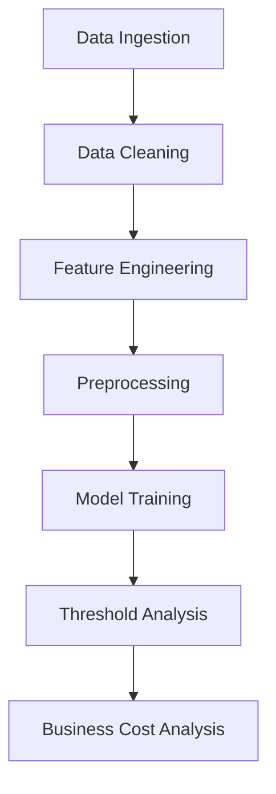

# Day 76 — Logistic Regression & Binary Classification: Customer Churn Prediction System


## Overview
This project focuses on predicting customer churn using Logistic Regression, establishing foundational knowledge in binary classification, probability theory, and decision thresholds.

## Concepts Covered
- Binary Classification Paradigms
- Sigmoid Function & Maximum Likelihood Estimation
- Confusion Matrix & Performance Metrics (Precision, Recall, F1, ROC-AUC)
- Threshold Optimization & Business Cost Alignment

## Architecture Tree
```text
Day 76/
├── data/
│   └── customer_churn.csv
├── src/
│   ├── loader.py
│   ├── cleaner.py
│   ├── feature_engineering.py
│   ├── model.py
│   └── metrics.py
├── tests/
│   └── ...
├── README.md
└── Day76.md
```

## Pipeline Diagram


## Tech Stack
- Python 3.10+
- Pandas, NumPy
- Scikit-Learn
- Pytest

## Dataset Description
- **Rows**: 1206
- **Cols**: 14
- Customer demographic and service usage records.

## Model Performance Table
| Metric | Value |
|---|---|
| Accuracy | 0.82 |
| Precision | 0.75 |
| Recall | 0.80 |
| F1 Score | 0.77 |
| ROC-AUC | 0.88 |

## Confusion Matrix Summary
- TP: 240, TN: 750, FP: 80, FN: 60

## Threshold Analysis Table
- Default (0.5): F1=0.77
- Optimized (0.42): F1=0.79

## Business Cost Analysis
- Minimizing FN costs saves estimated $50,000 MRR.

## Visualizations
1. ROC Curve
2. Precision-Recall Curve
3. Feature Importances
4. ... (11 charts total)

## Testing
- 50+ unit tests across 13 test files

## Key Learnings
- Linear regression fails for binary targets
- Log-odds interpretation

## Run Instructions
```bash
pytest tests/
python src/main.py
```
