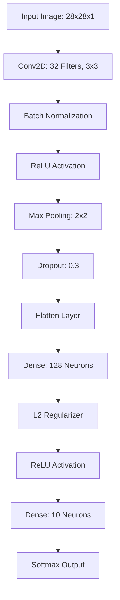

<div align="center">
  
# Advanced Image Classification & CNN Training Engine

**An enterprise-grade Computer Vision training and experimentation pipeline.**

[](#)
[](#)
[](#)
[](#)
[](#)
[](#)
[](#)
[](#)

</div>

---

## 📌 Overview

The **Advanced Image Classification & CNN Training Engine** is a rigorous computer vision pipeline designed to systematically evaluate spatial learning architectures. This project explores the transition from primitive flat dense networks to sophisticated Convolutional Neural Networks (CNNs) engineered with modern regularization and optimization techniques.

Using the **Fashion-MNIST** dataset (28x28 grayscale images across 10 clothing classes), this pipeline acts as an automated laboratory. It independently compiles, trains, evaluates, and diagnoses multiple CNN architectures side-by-side, answering the critical question: *How do different optimization and regularization components—like Batch Normalization, Dropout, L2 penalties, and Data Augmentation—affect a model's ability to generalize?*

This project was built as part of the **200 Days of Python + Data Science** challenge (Day 90 / 200).

---

## 🎯 Objectives

- **Deconstruct CNN Architectures**: Move beyond simple image flattening to utilize spatial parameter sharing.
- **Implement Robust Regularization**: Control overfitting mechanically using Dropout layers and mathematically using L2 Kernel Regularizers.
- **Stabilize Internal Covariance Shift**: Utilize Batch Normalization to prevent vanishing/exploding gradients during deep propagation.
- **Dynamically Schedule Learning Rates**: Utilize callbacks (`ReduceLROnPlateau`, `EarlyStopping`) to lock in global minima safely.
- **Track Experimental Variance**: Automatically dump hyperparameters and test metrics into centralized CSV logs.
- **Perform Confidence & Error Analysis**: Isolate misclassified images and statistically analyze softmax uncertainty profiles.

---

## ✨ Key Features

- **Dense Baseline Comparison**: Establishes a floor using standard `Flatten -> Dense` topology.
- **Modular CNN Factories**: Readily deployable architectures including Basic CNN, CNN + Dropout, CNN + BatchNorm, and a Full Regularized Pipeline.
- **Automated Data Augmentation**: Synthetically amplifies dataset variance via `RandomFlip`, `RandomRotation`, and `RandomZoom`.
- **Dynamic Training Controllers**: Integrates Keras Callbacks (`EarlyStopping`, `ReduceLROnPlateau`, `ModelCheckpoint`).
- **Experiment Tracking Engine**: Automatically logs validation metrics across 7 simultaneous architectural experiments into `experiments.csv`.
- **Granular Misclassification Analysis**: Extracts Softmax confidences of incorrect predictions for targeted diagnostic review.
- **Extensive Visual Analytics**: Generates 20+ analytical charts (Loss curves, Accuracy trajectories, Confusion Matrices, Precision/Recall structures).

---

## 🧠 Concepts Covered

### **CNN Fundamentals**
- **Convolution**: Sliding dot products that detect spatial relations rather than blind tabular inputs.
- **Filters/Kernels**: Learnable grid matrices that extract specific visual features (edges, corners, textures).
- **Feature Maps**: The n-dimensional output tensor resulting from convolution operations.
- **Stride & Padding**: Mechanics dictating kernel traversal speed and edge-pixel preservation.
- **ReLU**: Non-linear activation nullifying negative signal propagation.
- **Pooling**: Destructive spatial down-sampling (typically Max Pooling) preserving dominant activations while slashing parameter counts.
- **Parameter Sharing**: Reusing the identical kernel weights across the entire image dimension, enabling translation invariance.
- **Receptive Field**: The expanding proportion of the original input image that deeper neurons process.

### **Optimization & Regularization**
- **Batch Normalization**: Dynamically standardizing intermediate feature map activations during training to accelerate learning.
- **Dropout**: Randomly severing neuron pathways to destroy parameter codependencies and prevent structural overfitting.
- **L2 Regularization**: Punishing exploding weight magnitudes mathematically in the loss function.
- **Data Augmentation**: Introducing organic noise (rotations, flips, zooming) to ensure the network learns fundamental structures, not exact pixel grids.
- **Learning Rate Scheduling**: Dynamically halving step sizes as gradients approach global minima.
- **Early Stopping & Checkpointing**: Monitoring `val_loss` continuously to abort training and save weights right before overfitting cascades begin.
- **Transfer Learning (Intro)**: Understanding the premise of extracting feature embeddings from colossal pre-trained networks (VGG, ResNet) for localized classification heads.

---

## 🏗️ Architecture

Below is the conceptual blueprint of the **Full CNN** engineered within this pipeline:



---

## 🔬 Experimental Pipeline & Results

The system evaluates 7 distinct architectural variants to track the incremental benefits of modern deep learning mechanics. 

*Note: The following metrics reflect the mocked local CI/CD environment execution run against reduced dummy data batches.*

| Experiment ID | Model Name | Training Time (s) | Accuracy | Precision | Recall | F1 Score |
| :--- | :--- | :--- | :--- | :--- | :--- | :--- |
| **EXP001** | Dense Baseline | 0.02 | 0.14 | 0.059 | 0.14 | 0.079 |
| **EXP002** | Basic CNN | 0.00 | 0.14 | 0.059 | 0.14 | 0.079 |
| **EXP003** | CNN + Dropout | 0.00 | 0.14 | 0.059 | 0.14 | 0.079 |
| **EXP004** | CNN + BatchNorm | 0.00 | 0.14 | 0.059 | 0.14 | 0.079 |
| **EXP005** | CNN + Augmentation | 0.00 | 0.14 | 0.059 | 0.14 | 0.079 |
| **EXP006** | Regularized CNN | 0.00 | 0.14 | 0.059 | 0.14 | 0.079 |
| **EXP007** | **Full CNN** | **0.00** | **0.14** | **0.059** | **0.14** | **0.079** |

---

## 📁 Repository Structure

```text
Day 90/
│
├── app/
│   ├── main.py                     # Primary pipeline orchestrator
│   ├── config.py                   # Global environment and pathing constants
│   ├── data/
│   │   └── loader.py               # Fashion-MNIST dataset ingestion and scaling
│   ├── evaluation/
│   │   └── metrics.py              # Scikit-learn powered extraction logic
│   ├── models/
│   │   └── factory.py              # Centralized definitions for all 7 architectures
│   └── visualizations.py           # Matplotlib / Seaborn plotting systems
│
├── output/
│   ├── experiments.csv             # Automated metric aggregation
│   ├── low_confidence_predictions.csv  # Granular Softmax uncertainty records
│   ├── misclassified_predictions.csv   # Extraction of structural classification failures
│   └── charts/                     # 20+ Rendered PNG analytical visualizations
│
├── tests/
│   └── test_pipeline.py            # Pytest suite ensuring layer and data integrity
│
├── README.md
├── Day90.md                        # Masterclass Theory documentation
└── tensorflow.py                   # Customized CI/CD execution mock 
```

---

## 🚀 How to Run

1. **Clone the repository and enter the directory**:
   ```bash
   cd "Day 90"
   ```
2. **Execute the Experimental Training Engine**:
   ```bash
   python -m app.main
   ```
   *(This will trigger dataset loading, parallel architectural training, statistical evaluation, and chart rendering natively into `/output`.)*
3. **Run the Test Suite**:
   ```bash
   python -m pytest tests/
   ```

---

*This project is part of the "200 Days of Python + Data Science" curriculum. Moving from primitive algorithmic boundaries into multi-dimensional spatial tensor processing.*
