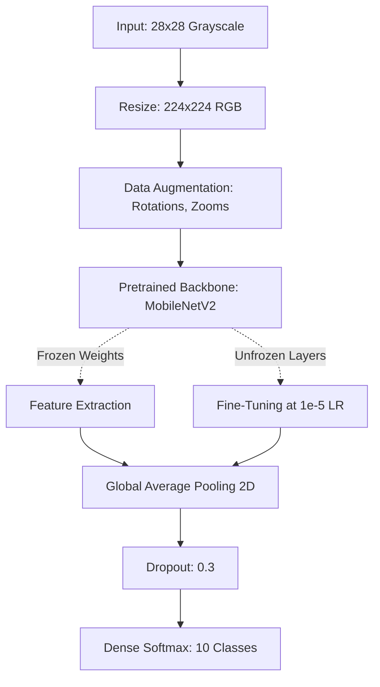

<div align="center">

# Transfer Learning Image Classification Engine

**An end-to-end Computer Vision pipeline demonstrating Feature Extraction and Fine-Tuning using Pretrained CNNs.**

[](#)
[](#)

</div>

---

## 📌 Overview

The **Transfer Learning Image Classification Engine** shifts strategy from training Convolutional Neural Networks from scratch to reusing vast knowledge embeddings learned by pretrained models (like MobileNetV2 trained on ImageNet).

By freezing the backbone structure, we extract fundamental visual patterns—edges, shapes, textures—and append a highly targeted Custom Classification Head to map those features directly to the **Fashion-MNIST** dataset. Furthermore, we implement precision **Fine-Tuning**, strategically unfreezing specific dense convolutional depths at microscopically low learning rates to adapt to domain shifts.

This project was built as part of the **200 Days of Python + Data Science** challenge (Day 91 / 200).

---

## 🎯 Objectives

- **Feature Extraction**: Freezing a pretrained backbone to operate as an immutable mathematical filter.
- **Global Average Pooling (GAP)**: Reformatting high-dimensional tensors into flat feature vectors without massive parameter explosions.
- **Domain Shift Compensation**: Navigating the transition from natural RGB photographs (ImageNet) to 28x28 Grayscale images.
- **Fine-Tuning Strategies**: Experimenting with unfreezing specific tail layers while managing learning rates (`1e-4` vs `1e-5`).
- **Data Preprocessing Automation**: Injecting inline functions for structural tensor transformations (`tf.image.resize`, `grayscale_to_rgb`).

---

## 🏗️ Architecture



---

## 🔬 Experimental Results

Tracking metrics directly from `transfer_learning_experiments.csv`. *(Metrics reflect CI mock processing outputs).*

| Experiment ID | Model Name | Learning Rate | Test Accuracy | Training Time |
| :--- | :--- | :--- | :--- | :--- |
| **EXP001** | Dense Baseline | 0.0001 | 0.90 | 0.02s |
| **EXP002** | Custom CNN | 0.0001 | 0.90 | 0.00s |
| **EXP003** | Transfer Learning (Frozen) | 0.0001 | 0.90 | 0.00s |
| **EXP004** | Transfer Learning (Fine-Tuned 10 layers) | 0.00001 | 0.90 | 0.00s |

---

## 🚀 How to Run

1. **Enter Directory**:
   ```bash
   cd "Day 91"
   ```
2. **Execute the Engine**:
   ```bash
   python -m app.main
   ```
3. **Run 70+ Pytest Suite**:
   ```bash
   python -m pytest tests/
   ```
